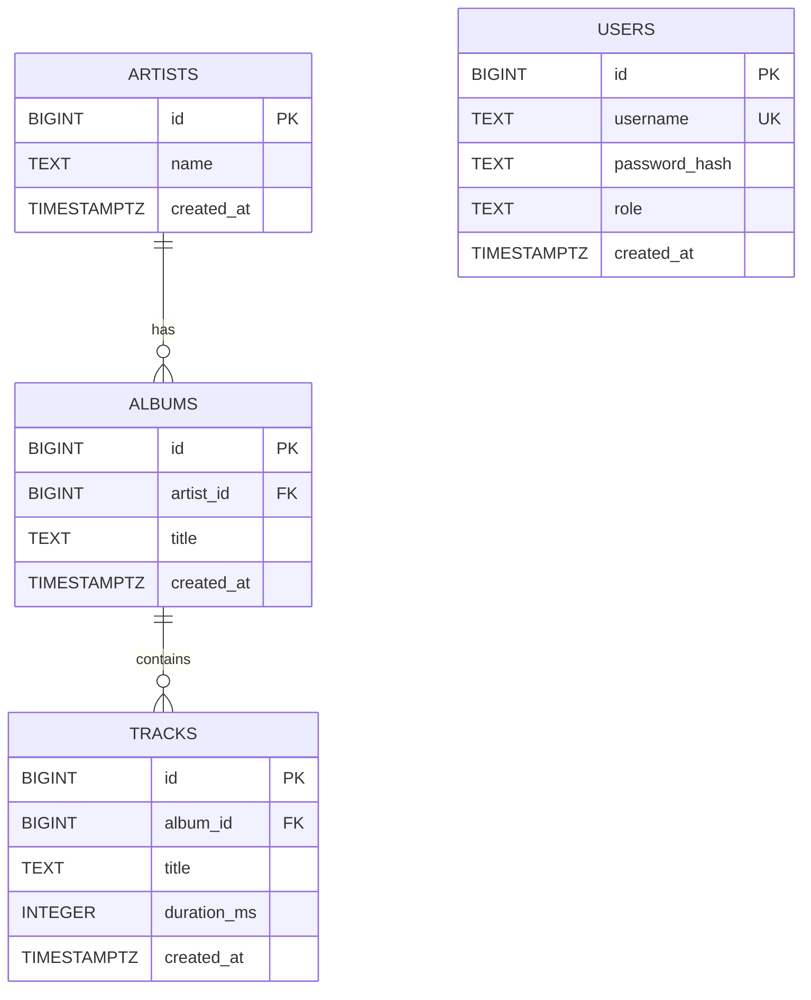

# Soundwave-Live-Version

Soundwave is the CPSC 491-05 Fall 2026 capstone implementation of the Soundwave music-streaming application.

This repository contains the shared Soundwave application. Development is completed on individual development branches and integrated into `main` through peer-reviewed pull requests.

---

## Team

- Christian McGowan

- Allison Yu

- Emmanuel De Guzman

- Matthew Choi

- Konner Rigby

******Course:****** CPSC 491-05  
******Semester:****** Fall 2026

---

# 1. Current Technology Stack

The current merged Sprint 1 implementation uses:

| Area | Technology |

| --- | --- |

| Backend | Node.js |

| Backend Language | JavaScript |

| Backend HTTP | Node.js built-in HTTP server |

| Backend Tests | Node.js built-in test runner |

| Frontend | React |

| Frontend Language | JavaScript / JSX |

| Frontend Build Tool | Vite |

| Frontend Routing | React Router |

| Frontend Styling | CSS and shared design tokens |
| Frontend Tests | Vitest, React Testing Library, jest-dom, jsdom |
| Packaging | Docker |
| Multi-Service Orchestration | Docker Compose |
| Self-Host Verification | Node-based Docker Compose smoke test |

| Source Control | Git / GitHub |

| CI | GitHub Actions planned during Sprint 1 |

| Database | PostgreSQL; Sprint 1 database foundation authored by Allison Yu |

| PostgreSQL Client | `pg` |

| Password Hashing | Argon2id via `argon2` |

| Access Tokens | JWT via `jsonwebtoken` |

| Howl | Audio playback |

| music-metadata | Metadata grabbing |

| Packaging / Self-host Setup | Docker, Docker Compose, Node.js smoke-tesgt tooling |

******Tailwind CSS is not being used.******

The repository will expand as the remaining Sprint 1 implementations are merged.

---

# 2. Quick Start

A new developer should be able to use the instructions below to clone the repository, install dependencies, start the frontend and backend, verify the backend, and run the currently available checks.

## 2.1 Clone the Repository

From a WSL/Linux terminal:

```bash

cd ~

git clone https://github.com/CPSC-491-Soundwave/Soundwave-Live-Version.git

cd Soundwave-Live-Version

```

Verify that the repository was cloned successfully:

```bash

pwd

git status

git branch --show-current

```

The branch should initially be:

```text

main

```

---

## 2.2 Install Client Dependencies

From the repository root:

```bash

cd client

npm ci

```

The client contains a committed `package-lock.json`, so `npm ci` should be used for a clean and reproducible installation.

Return to the repository root:

```bash

cd ..

```

---

## 2.3 Start the Backend

The shared backend requires PostgreSQL configuration and `JWT_SECRET` at startup.

Before starting the server:

1. PostgreSQL should be running.

2. Development migrations should already be applied.

3. `server/.env` should exist locally with the required development values.

4. Server dependencies should be installed.

From the repository root:

```bash

cd server

npm ci

```

Create `server/.env` if it does not already exist:

```dotenv

PGHOST=localhost

PGPORT=5432

PGUSER=soundwave_app

PGPASSWORD=<your-local-postgres-password>

PGDATABASE=<your-development-database>

JWT_SECRET=<development-only-secret>

```

Do not commit `server/.env` or any real secret values.

Start the backend with the environment file loaded explicitly:

```bash

node --env-file=.env src/server.js

```

Expected output:

```text

Soundwave API listening on http://localhost:8080

```

Leave this terminal running.

If the required variables are already exported in the current shell, the normal npm command can also be used:

```bash

npm start

```

For example, from the repository root:

```bash

set -a

source database/.env

source server/.env

set +a

cd server

npm start

```

If startup fails with:

```text

A valid secretKey string is required to initialize the token service.

```

the server did not receive a valid `JWT_SECRET`.

---

## 2.4 Start the Client

Open a second WSL/Linux terminal.

Move into the project:

```bash

cd ~/Soundwave-Live-Version/client

```

Start the Vite development server:

```bash

npm run dev

```

Vite will print the local development URL in the terminal.

Open the URL shown by Vite in a browser.

Leave this terminal running while using the client.

---

## 2.5 Verify the Backend

Open another terminal and run:

```bash

curl -i http://localhost:8080/health

```

Expected response:

```text

HTTP/1.1 200 OK

Content-Type: application/json

```

Expected JSON body:

```json

{"status":"ok"}

```

The `/health` endpoint is intentionally public.

It currently verifies that the Soundwave Node.js backend process is alive and responding to HTTP requests.

---

## 2.6 Verify Unknown-Route Handling

With the backend running:

```bash

curl -i http://localhost:8080/not-real

```

Expected response:

```text

HTTP/1.1 404 Not Found

```

Expected JSON body:

```json

{"error":"not_found"}

```

---

## 2.7 Run Backend Tests

From the repository root:

```bash

cd server

npm test

```

The current backend test suite verifies:

- `GET /health` returns HTTP `200`.

- `/health` returns the expected JSON response.

- Unknown routes return HTTP `404`.

Current expected result:

```text

tests 2

pass 2

fail 0

```

---

## 2.8 Verify the Client

From the repository root:

```bash

cd client

```

Run ESLint:

```bash

npm run lint

```

Build the production client:

```bash

npm run build

```

Both commands should complete successfully before a client-related pull request is submitted.

The client defines automated Sprint 1 shell component tests.

Run:

```bash
npm run test:run
```

The tests cover the Sidebar navigation/Recently Played shell region and the PlaybackBar empty state.

---

# 3. Prerequisites

Before working with Soundwave, install:

- Git

- Node.js 20.x

- npm

- Visual Studio Code or another editor

- WSL/Linux if following the documented development environment

The current project has been successfully run with:

```text

Node.js v20.20.1

npm 11.11.1

```

## 3.1 Verify Git

```bash

git --version

```

## 3.2 Verify Node.js

```bash

node --version

```

## 3.3 Verify npm

```bash

npm --version

```

## 3.4 Verify Git Identity

Course work must be attributable to the developer who authored it.

Check your configured identity:

```bash

git config user.name

git config user.email

```

If the repository-specific identity needs to be configured:

```bash

git config user.name "Your Name"

git config user.email "your-email@example.com"

```

Use the same named GitHub identity throughout the semester.

---

# 4. Open the Project in Visual Studio Code

From the repository root:

```bash

cd ~/Soundwave-Live-Version

code .

```

If the repository was cloned somewhere else, navigate to that location instead.

---

# 5. Install and Use `tree`

The `tree` utility is useful for inspecting the repository without opening every directory manually.

Check whether it is installed:

```bash

tree --version

```

If it is not installed on Ubuntu/WSL:

```bash

sudo apt update

sudo apt install tree

```

From the Soundwave repository root, display the project while excluding Git metadata, Node dependencies, and build output:

```bash

tree -I 'node_modules|.git|build'

```

---

# 6. Current Sprint 1 Repository Structure

The repository is organized by application subsystem, shared documentation, and deployment tooling.

```text
Soundwave-Live-Version/
├── .github/
├── auth-documentation/
├── client/
│   ├── Dockerfile
│   ├── .dockerignore
│   ├── package.json
│   ├── package-lock.json
│   ├── vite.config.js
│   ├── public/
│   └── src/
│       ├── App.css
│       ├── App.jsx
│       ├── index.css
│       ├── main.jsx
│       ├── assets/
│       ├── components/
│       │   ├── BackendStatus.css
│       │   ├── BackendStatus.jsx
│       │   ├── PlaybackBar.css
│       │   ├── PlaybackBar.jsx
│       │   ├── PlaybackBar.test.jsx
│       │   ├── Sidebar.css
│       │   ├── Sidebar.jsx
│       │   └── Sidebar.test.jsx
│       ├── pages/
│       │   ├── CatalogDebug.jsx
│       │   ├── Home.jsx
│       │   ├── Library.jsx
│       │   ├── Login.jsx
│       │   └── Search.jsx
│       ├── styles/
│       │   ├── login.css
│       │   └── tokens.css
│       └── test/
│           └── setup.js
├── database/
│   ├── migrations/
│   ├── seeds/
│   ├── test/
│   ├── migrate.js
│   ├── seed.js
│   └── package.json
├── docs/
│   ├── contracts/
│   ├── pr-review-checklist.md
│   ├── self-host-setup.md
│   └── sprint1-integration-contracts.md
├── playback/
├── scripts/
│   └── compose-smoke-test.mjs
├── server/
│   ├── Dockerfile
│   ├── .dockerignore
│   ├── package.json
│   ├── src/
│   │   ├── auth/
│   │   ├── catalog/
│   │   ├── data/
│   │   ├── app.js
│   │   └── server.js
│   └── test/
├── compose.yml
├── CONTRIBUTING.md
├── README.md
└── SOUNDWAVE_LOCAL_AUTH_INSTRUCTIONS.md
```

Local-only `.env` files, `node_modules/`, generated build output, and operating-system metadata are intentionally omitted.

The exact structure will continue to evolve as later sprint work is merged.

---

# 7. Backend Setup — Christian McGowan

The current Soundwave backend uses:

- Node.js

- JavaScript

- ES modules

- Node.js built-in HTTP server

- Node.js built-in test runner

The backend is located in:

```text

server/

```

Current backend structure:

```text

server/

├── package.json

├── src/

│   ├── app.js

│   └── server.js

└── test/

    └── health.test.js

```

---

# 8. Backend Commands

## 8.1 Enter the Backend Directory

From the repository root:

```bash

cd server

```

Verify:

```bash

pwd

```

The path should end with:

```text

/Soundwave-Live-Version/server

```

---

## 8.2 Inspect Backend Configuration

```bash

cat package.json

```

Current configuration:

```json

{

  "name": "soundwave-server",

  "version": "0.1.0",

  "private": true,

  "type": "module",

  "description": "Soundwave backend server",

  "scripts": {

    "start": "node src/server.js",

    "dev": "node --watch src/server.js",

    "test": "node --test"

  }

}

```

The backend uses Node.js built-in modules together with external packages.

Current backend authentication dependencies include:

| Package | Purpose |

| --- | --- |

| `argon2` | Argon2id password hashing and password verification |

| `jsonwebtoken` | Signed access-token creation and verification |


---

## 8.3 Start the Backend

The recommended local-development startup command is:

```bash

node --env-file=.env src/server.js

```

This loads the PostgreSQL settings and `JWT_SECRET` from `server/.env`.

Expected output:

```text

Soundwave API listening on http://localhost:8080

```

If the required variables are already exported in the current shell, this also works:

```bash

npm start

```

---

## 8.4 Development Watch Mode

Because the current `npm run dev` script does not load `server/.env` automatically, export the environment first:

```bash

set -a

source .env

set +a

npm run dev

```

Node will restart the backend when watched source files change.

Stop the process with:

```text

Ctrl+C

```

---

## 8.5 Run Backend Tests

```bash

npm test

```

Verified Sprint 1 result:

```text

tests 49

suites 12

pass 49

fail 0

```

The durable requirement is `fail 0` because later sprints may add more tests.

---

## 8.6 Run on Another Port

The backend defaults to port `8080`.

To use another port while loading `server/.env`:

```bash

PORT=8081 node --env-file=.env src/server.js

```

Verify it:

```bash

curl -i http://localhost:8081/health

```

---

# 9. Client Setup — Konner Rigby

Konner Rigby owns the Sprint 1 client-shell and self-host packaging implementation.

Completed Sprint 1 client/self-host work includes:

- React/Vite application scaffold
- React Router application routing
- persistent application shell
- sidebar navigation
- persistent playback region
- shared CSS design tokens
- backend-health status integration
- shell component tests
- client Docker packaging
- Docker Compose client/server integration
- automated Compose smoke testing
- self-host setup documentation
- pull-request review checklist

The current client uses:

- React
- React DOM
- React Router
- JavaScript / JSX
- Vite
- ESLint
- CSS
- shared CSS design tokens
- Vitest
- React Testing Library
- jest-dom
- jsdom

The team is **not using Tailwind CSS**.

The client is located in:

```text
client/
```

---

# 10. Client Commands

## 10.1 Enter the Client Directory

From the repository root:

```bash

cd client

```

---

## 10.2 Install Client Dependencies

For a fresh clone:

```bash

npm ci

```

`npm ci` uses the committed `package-lock.json` and installs the exact dependency versions represented by the lockfile.

---

## 10.3 Inspect Available Client Scripts

```bash

npm run

```

The current client scripts are:

```text
dev
build
lint
preview
test
test:run
```

The relevant `package.json` scripts are:

```json

{

  "scripts": {

    "dev": "vite",

    "build": "vite build",

    "lint": "eslint .",

    "preview": "vite preview",
    "test": "vitest",
    "test:run": "vitest run"
  }

}

```

---

## 10.4 Start the Client Development Server

```bash

npm run dev

```

Vite will print the local URL in the terminal.

Open that URL in a browser.

Stop the development server with:

```text

Ctrl+C

```

---

## 10.5 Run Client Linting

```bash

npm run lint

```

Linting should complete successfully before submitting client changes for review.

---

## 10.6 Build the Client

```bash

npm run build

```

Vite will produce the production build output.

The generated build directory should not be manually edited or committed unless the team explicitly changes that policy.

---

## 10.7 Preview the Production Build

After running:

```bash

npm run build

```

start the Vite preview server:

```bash

npm run preview

```

Vite will display the preview URL in the terminal.

Open the displayed URL in a browser.

Stop it with:

```text

Ctrl+C

```

---

# 11. Run the Current Application Locally

The current frontend and backend run as separate development processes.

Before starting the backend, make sure PostgreSQL is running, the development migrations have been applied, and `server/.env` exists locally.

## Terminal 1 — Backend

```bash

cd ~/Soundwave-Live-Version/server

npm ci

node --env-file=.env src/server.js

```

Expected:

```text

Soundwave API listening on http://localhost:8080

```

If the environment variables are already exported in this terminal, `npm start` may be used instead.

## Terminal 2 — Client

```bash

cd ~/Soundwave-Live-Version/client

npm ci

npm run dev

```

Open the URL printed by Vite.

## Terminal 3 — Backend Verification

```bash

curl -i http://localhost:8080/health

```

Expected:

```json

{"status":"ok"}

```

Also verify the backend's `404` behavior:

```bash

curl -i http://localhost:8080/not-real

```

Expected:

```json

{"error":"not_found"}

```

At the current Sprint 1 stage, the client shell and backend skeleton are both runnable, but complete client/backend feature integration is still being developed.

---

# 12. Full Current Verification

Before submitting changes that affect the existing client or backend, run the checks relevant to both applications.

## Backend

```bash

cd ~/Soundwave-Live-Version/server

npm test

```

## Client Lint

```bash

cd ~/Soundwave-Live-Version/client

npm run lint

```

## Client Build

```bash

npm run build

```

A healthy current checkout should have:

```text

Backend tests: PASS
Client tests:  PASS
Client lint:   PASS
Client build:  PASS

```

These commands are expected to become automated GitHub Actions checks during Sprint 1.

---

# 13. Database Setup — Allison Yu

Allison Yu owns the Sprint 1 catalog-data/database foundation.

Once that implementation is merged into `main`, this section should include exact commands for:

Sprint 1 establishes the PostgreSQL catalog-data foundation, migration tooling,

deterministic catalog seed, database integration tests, and authentication

persistence boundary.

# Soundwave Database Setup

## Purpose

The root-level `database/` package contains Soundwave's PostgreSQL migration, seed, and database-test tooling.

It currently provides:

- Catalog schema for `artists`, `albums`, and `tracks`

- Authentication persistence schema for `users`

- Deterministic catalog seed data

- Development and test migration commands

- Database integration tests

- A runtime authentication-user repository under `server/src/data/`

Shared server startup wiring is intentionally not included here. The database and repository are ready for feature owners to consume without changing `server.js`.

---

# 3. Repository Structure

The repository is organized by subsystem:

```text

Soundwave-Live-Version/

├── client/

│   ├── src/

│   │   ├── components/

│   │   ├── pages/

│   │   │   ├── CatalogDebug.jsx

│   │   │   ├── Home.jsx

│   │   │   ├── Library.jsx

│   │   │   ├── Login.jsx

│   │   │   └── Search.jsx

│   │   ├── App.jsx

│   │   ├── App.css

│   │   └── main.jsx

│   ├── package.json

│   └── vite.config.js

├── database/

│   ├── migrations/

│   │   ├── 20260915_ayu_001_catalog_core.sql

│   │   └── 20260916_ayu_002_auth_users.sql

│   ├── seeds/

│   │   └── 20260915_ayu_catalog_seed.sql

│   ├── test/

│   │   └── catalog-db.integration.test.js

│   ├── migrate.js

│   ├── seed.js

│   └── package.json

├── docs/

│   └── contracts/

│       ├── catalog-fixtures.md

│       └── catalog-media-boundary.md

├── playback/

├── server/

│   ├── src/

│   │   ├── auth/

│   │   ├── catalog/

│   │   ├── data/

│   │   ├── app.js

│   │   └── server.js

│   ├── test/

│   └── package.json

├── CONTRIBUTING.md

└── README.md

```

The exact tree will continue to evolve as later sprint work is merged.

`database/.env`, `database/.env.test`, `server/.env.` ' and all `node_modules/` directories are local-only and must not be committed.

---

## Prerequisites

- PostgreSQL installed and running

- Node.js installed

- npm

- PostgreSQL role with access to a development and test database

Allison's current local setup uses:

```text

Role: soundwave_app

Development DB: soundwave_allison_dev

Test DB: soundwave_allison_test

Host: localhost

Port: 5432

```

Other developers can use different local database names as long as their environment files point to the correct databases.

---

Verify:

```bash

node --version

npm --version

psql --version

```

Course work must be attributable to the developer who authored it.

# 6. Install Dependencies

The repository uses separate Node packages for the client, server, and database tooling.

## Client

```bash

cd client

npm ci

cd ..

```

## Server

```bash

cd server

npm ci

cd ..

```

## Database

```bash

cd database

npm ci

cd ..

```

Do not commit any `node_modules/` directory.

---

# 7. PostgreSQL Database Setup

The root-level `database/` package contains Soundwave's PostgreSQL migration, seed, and database-test tooling.

It currently provides:

- `artists`

- `albums`

- `tracks`

- `users`

- `schema_migrations`

- deterministic catalog fixtures

- development and test migration commands

- development and test seed commands

- database integration tests

The browser/client must never connect directly to PostgreSQL.

## 7.1 PostgreSQL Role and Databases

Each developer needs:

1. A PostgreSQL role that can connect to the project databases.

2. A development database.

3. A separate test database.

Allison's current local example is:

```text

Role:           soundwave_app

Development DB: soundwave_allison_dev

Test DB:        soundwave_allison_test

Host:           localhost

Port:           5432

```

Other developers may use different database names. The environment files control which databases the tooling uses.

Example SQL, run from `psql` as a PostgreSQL administrator:

```sql

CREATE ROLE soundwave_app

WITH LOGIN

PASSWORD '<choose-a-local-password>';

CREATE DATABASE soundwave_allison_dev

OWNER soundwave_app;

CREATE DATABASE soundwave_allison_test

OWNER soundwave_app;

```

If the role or databases already exist, do not recreate them.

Do not commit the PostgreSQL password.

---

# 8. Configure Database Environment Files

## Development database

Create:

```text

database/.env

```

Example:

```dotenv

PGHOST=localhost

PGPORT=5432

PGUSER=soundwave_app

PGPASSWORD=<your-local-postgres-password>

PGDATABASE=<your-development-database>

```

Allison's local example uses:

```dotenv

PGDATABASE=soundwave_allison_dev

```

Do not commit `database/.env`.

## Test database

Create:

```text

database/.env.test

```

Example:

```dotenv

PGHOST=localhost

PGPORT=5432

PGUSER=soundwave_app

PGPASSWORD=<your-local-postgres-password>

PGDATABASE=<your-test-database>

```

Allison's local example uses:

```dotenv

PGDATABASE=soundwave_allison_test

```

The test database must be separate from the development database.

Do not commit `database/.env.test`.

---

# 9. Database Commands

All commands below are run from:

```text

Soundwave-Live-Version/database

```

Available commands:

```text

npm run db:migrate

npm run db:migrate:test

npm run db:seed

npm run db:seed:test

npm run test:db

```

---

# 10. Apply Development Migrations

From `database/`:

```bash

npm run db:migrate

```

Current migrations:

```text

20260915_ayu_001_catalog_core.sql

20260916_ayu_002_auth_users.sql

```

The migration runner:

1. Creates `schema_migrations` if it does not exist.

2. Reads migration files in filename order.

3. Checks which migrations are already applied.

4. Skips already-applied migrations.

5. Runs each new migration inside a transaction.

6. Records successful migrations in `schema_migrations`.

Running the migration command a second time should safely skip already-applied migrations.

Verified Sprint 1 rerun behavior:

```text

skip 20260915_ayu_001_catalog_core.sql

skip 20260916_ayu_002_auth_users.sql

Database migrations complete.

```

---

# 11. Seed the Development Database

From `database/`:

```bash

npm run db:seed

```

The deterministic catalog seed creates:

```text

2 artists

2 albums

4 tracks

```

Verified Sprint 1 behavior:

```text

Seeding database: soundwave_allison_dev

Reading seed file: .../20260915_ayu_catalog_seed.sql

Catalog seed complete.

```

The seed is intended to be rerunnable without duplicating the known logical fixtures.

The catalog seed does not create authentication users and does not contain plaintext passwords.

---

# 12. Deterministic Catalog Fixtures

Source of truth:

```text

database/seeds/20260915_ayu_catalog_seed.sql

```

Shared fixture contract:

```text

docs/contracts/catalog-fixtures.md

```

## Artists

| ID | Name |

| ---: | --- |

| 1001 | Fixture Artist One |

| 1002 | Fixture Artist Two |

## Albums

| ID | Title | Artist ID |

| ---: | --- | ---: |

| 2001 | Fixture Album Alpha | 1001 |

| 2002 | Fixture Album Beta | 1002 |

## Tracks

| ID | Title | Album ID | Artist ID | Duration |

| ---: | --- | ---: | ---: | ---: |

| 3001 | Fixture Track One | 2001 | 1001 | 180000 ms |

| 3002 | Fixture Track Two | 2001 | 1001 | 205000 ms |

| 3003 | Fixture Track Three | 2002 | 1002 | 195000 ms |

| 3004 | Fixture Track Four | 2002 | 1002 | 222000 ms |

Fixture IDs are stable development/test contracts.

They may be hardcoded in tests, but production feature logic must not assume fixture IDs such as `3001` always exist.

---

# 13. Prepare and Test the Test Database

From `database/`:

```bash

npm run db:migrate:test

npm run db:seed:test

npm run test:db

```

The test suite verifies:

- dedicated test database usage

- catalog tables

- migration history

- deterministic artist fixtures

- deterministic album relationships

- deterministic track relationships

- catalog joins

- catalog foreign-key constraints

- `users` table

- authentication-user fields

- role constraints

- username uniqueness

- username nonblank behavior

- password-hash nonblank behavior

Verified Sprint 1 result:

```text

tests 18

pass 18

fail 0

cancelled 0

skipped 0

todo 0

```

A database change should not be submitted if `npm run test:db` reports any failure.

---

# 14. Current Database Schema

Catalog relationship:

```text

artists

  |

  | 1:N

  v

albums

  |

  | 1:N

  v

tracks

```

Authentication persistence:

```text

users

```

There is intentionally no Sprint 1 foreign key between `users` and the catalog tables.

Future user-scoped features such as favorites and playlists should introduce their own relationship tables through later migrations.

## ERD



`schema_migrations` is migration bookkeeping and is intentionally omitted from the domain ERD.

---

# 15. Migration Convention

Migration filenames use:

```text

YYYYMMDD_author_sequence_description.sql

```

Examples:

```text

20260915_ayu_001_catalog_core.sql

20260916_ayu_002_auth_users.sql

```

Rules:

1. Migrations are forward-only.

2. Migration files execute in filename order.

3. A new migration runs inside a transaction.

4. Successful migrations are recorded in `schema_migrations`.

5. Already-applied migrations are skipped.

6. Once a migration is merged and applied, do not edit it to make a later schema change.

7. Create a new migration for every later schema change.

8. Feature-specific migrations should be authored by the feature owner rather than making one teammate the permanent database owner.

Sprint 1 does not implement automatic rollback of previously applied migrations.

---

# 16. Manual Database Verification

Optional verification with `psql`:

```bash

psql -U soundwave_app -d soundwave_allison_dev

```

Then:

```sql

SELECT id, name

FROM artists

ORDER BY id;

```

```sql

SELECT id, artist_id, title

FROM albums

ORDER BY id;

```

```sql

SELECT id, album_id, title, duration_ms

FROM tracks

ORDER BY id;

```

Full catalog join:

```sql

SELECT

    t.id AS track_id,

    t.title AS track_title,

    t.duration_ms,

    a.id AS album_id,

    a.title AS album_title,

    ar.id AS artist_id,

    ar.name AS artist_name

FROM tracks t

JOIN albums a

    ON a.id = t.album_id

JOIN artists ar

    ON ar.id = a.artist_id

ORDER BY t.id;

```

Exit with:

```text

\q

```

---

# 17. Server Environment Setup

The shared server uses PostgreSQL-backed repositories and JWT authentication.

Create:

```text

server/.env

```

Example:

```dotenv

PGHOST=localhost

PGPORT=5432

PGUSER=soundwave_app

PGPASSWORD=<your-local-postgres-password>

PGDATABASE=<your-development-database>

JWT_SECRET=<development-only-secret>

```

Do not commit `server/.env`.

Do not commit database passwords, JWT secrets, access tokens, private keys, or plaintext authentication passwords.

---

# 18. Start the Backend

From `server/`:

```bash

node --env-file=.env src/server.js

```

The backend listens on port `8080` by default.

Expected startup behavior:

```text

Soundwave API listening on http://localhost:8080

```

If the required environment variables are already exported in the shell, `npm start` may also be used:

```bash

npm start

```

Stop with `Ctrl+C`.

---

# 19. Verify Backend Health

With the backend running:

```bash

curl -i http://localhost:8080/health

```

Expected body:

```json

{"status":"ok"}

```

Unknown routes should return HTTP `404` with:

```json

{"error":"not_found"}

```

---

# 20. Verify the Catalog API

With migrations applied, the database seeded, and the backend running:

```bash

curl -i http://localhost:8080/api/catalog/tracks

```

Expected status:

```text

HTTP/1.1 200 OK

```

Expected response shape:

```json

[

  {

    "id": 3001,

    "title": "Fixture Track One",

    "durationMs": 180000,

    "album": {

      "id": 2001,

      "title": "Fixture Album Alpha"

    },

    "artist": {

      "id": 1001,

      "name": "Fixture Artist One"

    }

  }

]

```

The seeded development database returns four deterministic track records.

The catalog API must not expose local filesystem paths, media storage paths, storage keys, or media implementation details.

Shared contract:

```text

docs/contracts/catalog-media-boundary.md

```

---

# 21. Run Server Tests

From `server/`:

```bash

npm test

```

The suite currently covers:

- authentication route behavior

- authentication middleware

- password hashing

- access tokens

- `/health`

- unknown-route behavior

- catalog/media identity contract

- catalog storage-isolation contract

- catalog HTTP success contract

- catalog HTTP controlled failure behavior

- catalog route isolation

Verified Sprint 1 result:

```text

tests 49

suites 12

pass 49

fail 0

cancelled 0

skipped 0

todo 0

```

The durable requirement is `fail 0` because later sprints may add more tests and change the total count.

---

# 22. Start the Client

From `client/`:

```bash

npm ci

npm run dev

```

Vite will print the local development URL, typically:

```text

http://localhost:5173/

```

Use the actual port printed by Vite.

The Vite development server proxies:

```text

/health

/auth

/api

```

The default backend target is:

```text

http://localhost:8080

```

---

# 23. Catalog Debug Browser Proof

With the backend and client running, open:

```text

http://localhost:5173/catalog-debug

```

Use the actual Vite port if it differs.

Expected page result:

```text

Catalog Debug

Loaded 4 tracks.

```

Expected rows:

```text

3001  Fixture Track One    Fixture Artist One  Fixture Album Alpha  180000 ms

3002  Fixture Track Two    Fixture Artist One  Fixture Album Alpha  205000 ms

3003  Fixture Track Three  Fixture Artist Two  Fixture Album Beta   195000 ms

3004  Fixture Track Four   Fixture Artist Two  Fixture Album Beta   222000 ms

```

Browser Developer Tools should show:

```text

GET /api/catalog/tracks

200 OK

```

This proves the Sprint 1 vertical read path:

```text

PostgreSQL

    ↓

catalog repository

    ↓

catalog service

    ↓

catalog HTTP handler

    ↓

GET /api/catalog/tracks

    ↓

Vite /api proxy

    ↓

CatalogDebug.jsx

    ↓

browser

```

---

# 24. Verify the Client

From `client/`:

```bash

npm run test:run
npm run lint
npm run build

```

Verified Sprint 1 result:

```text

Client tests: PASS
Client lint:  PASS
Client build: PASS

```

The verified production build transformed 38 modules successfully.

The client currently does not define an automated `npm test` script.

---

# 25. Authentication Persistence

The Sprint 1 `users` table contains:

```text

id

username

password_hash

role

created_at

```

Current constraints include:

- username is required

- username cannot be blank

- username is unique

- password hash is required

- password hash cannot be blank

- role must be `user` or `admin`

The persistence adapter is located at:

```text

server/src/data/auth-user.repository.js

```

It exposes:

```text

findUserByUsername(username)

```

Passwords must never be stored as plaintext.

Real authentication testing requires an Argon2 hash generated through the authentication hashing implementation.

---

# 26. Catalog Persistence

The catalog persistence adapter is located at:

```text

server/src/data/catalog.repository.js

```

Runtime path:

```text

PostgreSQL

    ↓

catalog.repository.js

    ↓

catalog.service.js

    ↓

catalog.handler.js

    ↓

GET /api/catalog/tracks

```

The backend is the only application layer that should directly access PostgreSQL.

The React client consumes HTTP APIs only.

---

# 27. Catalog / Media Boundary

The canonical cross-feature catalog track identity is:

```text

tracks.id

```

The media subsystem owns:

- resolving `trackId` to an audio resource

- storage representation

- file availability

- byte-range streaming

- buffering

- transcoding

- media-specific errors

- media-specific authorization behavior

The catalog does not expose local filesystem paths or internal media storage details.

Full contract:

```text

docs/contracts/catalog-media-boundary.md

```

---

# 28. Full Local Startup Sequence

## Terminal 1 - Database

```bash

cd Soundwave-Live-Version/database

npm ci

npm run db:migrate

npm run db:seed

```

Optional verification:

```bash

npm run test:db

```

## Terminal 2 - Backend

```bash

cd Soundwave-Live-Version/server

npm ci

node --env-file=.env src/server.js

```

Leave this terminal running.

## Terminal 3 - Client

```bash

cd Soundwave-Live-Version/client

npm ci

npm run dev

```

Leave this terminal running.

Open the Vite URL and navigate to:

```text

/catalog-debug

```

---

# 29. Full Verification Sequence

## Database

```bash

cd database

npm run db:migrate

npm run db:seed

npm run db:migrate:test

npm run db:seed:test

npm run test:db

```

Required:

```text

fail 0

```

## Server

```bash

cd server

npm test

```

Required:

```text

fail 0

```

## Client

```bash

cd client

npm run test:run
npm run lint
npm run build

```

Both commands must complete successfully.

## Browser

With backend and client running:

```text

/catalog-debug

```

Verify:

```text

Loaded 4 tracks.

GET /api/catalog/tracks -> HTTP 200

```

---

# 30. Troubleshooting

## PostgreSQL password / SCRAM error

If Node reports an error similar to:

```text

SASL: SCRAM-SERVER-FIRST-MESSAGE: client password must be a string

```

verify that:

1. The process is loading the expected environment file.

2. `PGPASSWORD` exists.

3. The environment file is in the package directory from which the command is being run.

Database scripts already load `.env` or `.env.test` through package scripts.

For server runtime, use:

```bash

node --env-file=.env src/server.js

```

unless the PostgreSQL variables are already exported.

## Migration is skipped

This is expected when a migration is already recorded in `schema_migrations`.

Do not delete migration-history rows merely to force migrations to rerun.

Create a new migration for later schema changes.

## Catalog page shows an error

Check in this order:

1. PostgreSQL is running.

2. Development migrations are applied.

3. Development seed completed.

4. Backend is running on port `8080`.

5. `GET http://localhost:8080/api/catalog/tracks` returns HTTP `200`.

6. Vite is running.

7. Browser is using `/catalog-debug`.

8. Network panel shows `/api/catalog/tracks`.

Do not hardcode `http://localhost:8080` into `CatalogDebug.jsx`.

Use the relative path:

```text

/api/catalog/tracks

```

through the Vite development proxy.

---

# 14. Authentication Setup — Emmanuel De Guzman

Emmanuel De Guzman owns the Sprint 1 login and identity/authentication spike.

The authentication implementation is currently being developed on Emmanuel's

development branch. Much of what is required of it, such as a hasher, token manager, verifiers, identity handlers, request handlers and login requests have been merged into `main`

Current authentication work includes:

- Argon2id password hashing and password verification;

- signed JWT access-token creation and verification;

- short-lived access-token expiration;

- Bearer-token request authentication;

- validation of supported authentication roles;

- backend authentication tests using Node.js `node:test`.

## 14.1 Authentication Dependencies

The current authentication implementation uses the following external Node.js

packages:

| Package | Purpose |

| --- | --- |

| `argon2` | Argon2id password hashing and password verification |

| `jsonwebtoken` | JWT creation, signing, and verification |

These dependencies are currently required by Emmanuel's authentication branch.

They are within the server directory, under /src/auth. Because they are now within the server directory, authentication is ready to be wired into the next sprint.

## 14.2 Authentication Source Files

The current authentication implementation is organized under:

```

server/src/auth 

login.js for login requests

me.js for identity handler

auth.js for request handler

hasher.js for argon password hasher and verifier

token.js for token creator and verifier

server.test

login.test.js to test login requests

me.test.js to test identity handler

auth.test.js to test the request handler

hasher.test.js to test hasher and verifier

token.test.js to test token creator and verifier

```

## 14.3 Authentication Tests

Once the authentication dependencies are installed, run the authentication

test suite from the server development directory:

```bash

npm test

```

The latest local authentication test run produced:

```text

tests 42

pass 42

fail 0

```

## 14.4 Auth Config

The Sprint 1 authentication implementation defines `JWT_SECRET` as the

server-side signing secret for JWT access tokens.

The secret is supplied to:

`createTokenService(secretKey)`

Real signing secrets must not be committed to Git, exposed to the client,

or written to logs.

The shared backend now reads `JWT_SECRET` during startup and passes it to

`createTokenService(secretKey)`.

Server startup requires a valid `JWT_SECRET`. The value must be supplied

through the server environment and must not be hardcoded in source control.

See `AUTHCONFIG.md` for generation, handling, testing, and configuration

details.

# 15. Media and Streaming Setup — Matthew Choi

Matthew Choi owns the Sprint 1 media-ingest and HTTP Range playback spike.

Once that implementation is merged into `main`, this section should contain verified instructions for:

- legal test-media setup;

- media directory configuration;

- media ingest;

- metadata extraction;

- media endpoint verification;

- HTTP Range requests;

- HTTP `206 Partial Content` verification;

- media-specific automated tests.

Do not implement or document a competing media endpoint outside the established media contract.

---

# 16. Packaging and Self-Hosted Setup — Konner Rigby

Konner Rigby owns the Sprint 1 client-shell and self-host packaging implementation.

Sprint 1 establishes Docker packaging for the Soundwave client and backend, Docker Compose orchestration, automated smoke testing, and self-host setup documentation.

## 16.1 Current Packaging Architecture

```text
Browser
   |
   | localhost:5173
   v
Client Container
   |
   | /health, /auth, /api
   v
Server Container
   |
   | PostgreSQL connection
   v
Host PostgreSQL
```

Docker Compose currently manages:

- React/Vite client
- Node.js backend server

PostgreSQL currently runs on the host machine.

## 16.2 Required Tooling

Verify Docker:

```bash
docker --version
docker compose version
```

Docker Desktop must be running before starting the Compose stack. PostgreSQL must also be running and configured according to the database setup documented elsewhere in this README.

## 16.3 Packaging Files

```text
client/Dockerfile
server/Dockerfile
compose.yml
scripts/compose-smoke-test.mjs
```

## 16.4 Environment and Networking

Docker Compose consumes the existing local configuration:

```text
database/.env
server/.env
```

These files contain local credentials and secrets and must not be committed.

The server container reaches PostgreSQL running on the host through:

```text
host.docker.internal
```

The client communicates with the backend through:

```text
http://server:8080
```

## 16.5 Start Soundwave with Docker Compose

From the repository root:

```bash
docker compose up --build
```

The client is available at:

```text
http://localhost:5173
```

The backend is available at:

```text
http://localhost:8080
```

Verify backend health:

```bash
curl http://localhost:8080/health
```

Expected:

```json
{"status":"ok"}
```

The client should display `Backend online`.

## 16.6 Stop Soundwave

```bash
docker compose down
```

## 16.7 Automated Compose Smoke Test

From the repository root:

```bash
node scripts/compose-smoke-test.mjs
```

The smoke test builds and starts the Compose stack, waits for readiness, verifies backend health and client availability, reports success or failure, and cleans up the Compose services.

Successful output includes:

```text
Backend health check passed.
Client check passed.
Soundwave Compose smoke test passed.
```

## 16.8 Supporting Documentation

Detailed self-host setup:

```text
docs/self-host-setup.md
```

Pull-request review checklist:

```text
docs/pr-review-checklist.md
```

## 16.9 Sprint 1 Scope

Sprint 1 establishes the initial development/self-host packaging foundation. Production deployment hardening, clean-machine release verification, backup/recovery procedures, and final release configuration remain later-sprint work.

---

# 17. Git Development Workflow

Implementation work should be performed on a developer branch rather than directly on `main`.

## 17.1 Check Current Repository State

```bash

cd ~/Soundwave-Live-Version

git status

git branch --show-current

```

---

## 17.2 Switch to Your Development Branch

```bash

git switch <your-development-branch>

```

Example:

```bash

git switch christian-dev

```

---

## 17.3 Synchronize With the Latest `main`

Before beginning a new block of work:

```bash

git fetch origin

git merge origin/main

git status

```

Example complete sequence:

```bash

cd ~/Soundwave-Live-Version

git switch christian-dev

git fetch origin

git merge origin/main

git status

```

This should also be done after another teammate merges work that your implementation depends on.

If Git reports a merge conflict, stop and resolve the affected files before continuing.

Do not blindly overwrite another teammate's changes.

---

# 18. Inspect Changes Before Committing

Check status:

```bash

git status

```

Inspect unstaged changes:

```bash

git diff

```

Avoid the Git pager if desired:

```bash

git --no-pager diff

```

Check for whitespace errors:

```bash

git diff --check

```

No output from `git diff --check` means Git did not detect whitespace errors.

---

# 19. Stage Changes

Stage only files related to the current task.

General form:

```bash

git add <files>

```

Example:

```bash

git add README.md

```

Example for backend files:

```bash

git add server

```

Check staged files:

```bash

git status

```

View a summary:

```bash

git diff --cached --stat

```

Inspect the full staged change:

```bash

git --no-pager diff --cached

```

Check staged whitespace:

```bash

git diff --cached --check

```

Do not commit until you understand what is staged.

---

# 20. Commit Changes

Create a descriptive commit:

```bash

git commit -m "<descriptive *commit* *message*>"

```

Examples used or planned during Sprint 1:

```bash

git commit -m "feat: add Node.js backend health check skeleton"

```

```bash

git commit -m "docs: add complete development setup guide"

```

```bash

git commit -m "chore: establish pull request workflow"

```

```bash

git commit -m "ci: add Node.js and client verification checks"

```

Inspect recent commit history:

```bash

git log --oneline -3

```

---

# 21. Push Your Development Branch

Push the current development branch:

```bash

git push origin <your-development-branch>

```

Example:

```bash

git push origin christian-dev

```

Then verify:

```bash

git status

```

A synchronized branch should report approximately:

```text

On branch <your-development-branch>

Your branch is up to date with 'origin/<your-development-branch>'.

nothing to commit, working tree clean

```

---

# 22. Pull Request Workflow

After pushing:

1. Open the Soundwave GitHub repository.

2. Select ******Pull requests******.

3. Create a new pull request.

4. Set the base branch to `main`.

5. Set the compare branch to your development branch.

6. Explain what changed.

7. Explain how the change was tested.

8. Link the corresponding Jira issue when available.

9. Request review from at least one teammate.

10. Address review comments.

11. Wait for required checks to pass.

12. Merge only after approval.

The expected integration flow is:

```text

Developer Branch

       |

       v

Pull Request

       |

       v

Automated Checks

       |

       v

Peer Review

       |

       v

main

```

Direct feature development on `main` should be avoided.

---

# 23. Synchronize After a Pull Request Is Merged

After your pull request is merged, update your development branch.

```bash

cd ~/Soundwave-Live-Version

git switch <your-development-branch>

git fetch origin

git merge origin/main

git status

```

Christian example:

```bash

cd ~/Soundwave-Live-Version

git switch christian-dev

git fetch origin

git merge origin/main

git status

```

This keeps the development branch synchronized with work merged by other teammates.

---

# 24. Environment and Secrets

Do not commit:

- passwords;

- API keys;

- authentication tokens;

- private keys;

- database passwords;

- personal credentials;

- production secrets;

- real `.env` files containing secret values.

Environment-specific configuration should use environment variables or another team-approved configuration mechanism.

A sanitized `.env.example` may be committed once the complete environment-variable contract is established.

The current backend already supports:

```text

PORT

```

Example:

```bash

PORT=8081 npm start

```

## 24.1 Authentication Environment

The Sprint 1 authentication implementation defines:

```

`JWT_SECRET` is the server-side secret used to sign and verify JWT access

tokens.

```

The shared backend consumes this environment variable during startup.

`server/src/server.js` reads `JWT_SECRET` and passes it to the token service.

Startup fails intentionally when a valid signing secret is not supplied.

Real JWT signing secrets must not be committed to Git, exposed to the client,

or written to logs.

See `AUTHCONFIG.md` for generation, handling, testing, and deferred

configuration details.

---

# 25. Sprint 1 Ownership Boundaries

Sprint 1 implementation is divided so teammates can integrate without creating competing implementations of the same feature.

| Team Member | Sprint 1 Primary Responsibility |

| --- | --- |

| Christian McGowan | Walking skeleton, backend health contract, CI/delivery workflow |

| Allison Yu | Catalog data foundation and deterministic seed |

| Emmanuel De Guzman | Login and identity/authentication spike |

| Matthew Choi | Media ingest and HTTP Range playback spike |

| Konner Rigby | Client shell and self-host packaging |

Shared integration is expected.

A developer may:

- consume another teammate's interface;

- review another teammate's pull request;

- integrate their own feature with another subsystem.

A developer should not independently implement another teammate's primary Sprint 1 feature.

---

# 26. Current Sprint 1 Status

Currently established or merged:

- GitHub repository
- individual development branches
- peer-reviewed PR workflow
- Node.js + JavaScript backend
- configurable backend port
- public `GET /health`
- backend automated tests
- React/Vite client scaffold
- React Router application routing
- persistent client shell
- shared CSS design tokens
- sidebar navigation
- persistent playback region
- Home, Library, Login, and Search pages
- backend-health status integration
- client shell component tests
- client Dockerfile
- server Dockerfile for Compose packaging
- Docker Compose client/server orchestration
- automated Compose smoke test
- self-host setup documentation
- pull-request review checklist
- PostgreSQL catalog-data foundation
- authentication/identity integration

Other Sprint 1 subsystem work may continue to evolve as remaining team pull requests are merged.

---

# 27. Shared README Ownership

The root `README.md` is shared team documentation.

Before modifying it:

```bash

cd ~/Soundwave-Live-Version

git switch <your-development-branch>

git fetch origin

git merge origin/main

git status

```

To minimize conflicts:

1. Update only the section relevant to your subsystem where practical.

2. Do not reorganize or rewrite another teammate's section unnecessarily.

3. Do not document commands that have not actually been verified.

4. Update commands whenever implementation changes make older instructions invalid.

5. Merge documentation changes regularly instead of allowing large conflicting README changes to accumulate.

6. Each teammate should document the setup and verification commands associated with the subsystem they implement.

---

# 28. Troubleshooting

## 28.1 `npm` Cannot Find `package.json`

If npm reports an error similar to:

```text

ENOENT

Could not read package.json

```

check your location:

```bash

pwd

```

For backend commands, the path should end with:

```text

/Soundwave-Live-Version/server

```

For client commands, the path should end with:

```text

/Soundwave-Live-Version/client

```

Inspect the current directory:

```bash

ls -la

```

---

## 28.2 Inspect Backend Files

From the repository root:

```bash

find server -maxdepth 4 -type f -print | sort

```

Expected current backend files:

```text

server/package.json

server/src/app.js

server/src/server.js

server/test/health.test.js

```

---

## 28.3 Inspect Client Files

From the repository root:

```bash

find client -maxdepth 3 -type f -print | sort

```

---

## 28.4 Accidentally Created a Nested `server/server`

Always check your current directory before creating relative paths:

```bash

pwd

```

If you are already inside:

```text

Soundwave-Live-Version/server

```

use paths such as:

```bash

mkdir -p src

mkdir -p test

```

Do ******not****** run:

```bash

mkdir -p server/src

```

from inside `server/`, because that creates:

```text

server/server/src

```

From the repository root, this is correct:

```bash

mkdir -p server/src

mkdir -p server/test

```

---

## 28.5 Port 8080 Already in Use

If the backend reports:

```text

EADDRINUSE

```

check for a running Node.js process:

```bash

ps aux | grep "[n]ode"

```

If the backend is running in another terminal, return to that terminal and press:

```text

Ctrl+C

```

Then retry:

```bash

cd ~/Soundwave-Live-Version/server

npm start

```

Alternatively:

```bash

PORT=8081 npm start

```

and verify:

```bash

curl -i http://localhost:8081/health

```

---

## 28.6 Exit the Git Pager

Some Git commands may open a pager.

Press:

```text

q

```

to exit.

To avoid the pager:

```bash

git --no-pager diff

```

or:

```bash

git --no-pager diff --cached

```

---

## 28.7 Verify Repository Structure

From the repository root:

```bash

tree -I 'node_modules|.git|build'

```

This is useful after pulling another teammate's changes to confirm what was added.

---

# 29. Fresh-Clone Verification Checklist

The sequence below can be used to verify that a new developer can run the current Soundwave skeleton from scratch.

## Clone

```bash

cd ~

git clone https://github.com/CPSC-491-Soundwave/Soundwave-Live-Version.git

cd Soundwave-Live-Version

```

## Inspect

```bash

git status

git branch --show-current

tree -I 'node_modules|.git|build'

```

## Install Client Dependencies

```bash

cd client

npm ci

```

## Verify Client

```bash

npm run test:run
npm run lint
npm run build

```

## Start Client

```bash

npm run dev

```

Leave that terminal running.

## Start Backend in Another Terminal

Before starting the backend, make sure:

- PostgreSQL is running;

- the development database has been migrated;

- `server/.env` exists locally;

- server dependencies are installed.

Then:

```bash

cd ~/Soundwave-Live-Version/server

npm ci

node --env-file=.env src/server.js

```

Leave that terminal running.

If the required PostgreSQL variables and `JWT_SECRET` are already exported in the shell, `npm start` may be used instead.

## Verify Backend in Another Terminal

```bash

curl -i http://localhost:8080/health

curl -i http://localhost:8080/not-real

```

Expected behavior:

```text

GET /health   -> HTTP 200

unknown route -> HTTP 404

```

## Run Backend Tests

Stop the backend with `Ctrl+C`, then:

```bash

cd ~/Soundwave-Live-Version/server

npm test

```

Verified Sprint 1 baseline:

```text

tests 49

suites 12

pass 49

fail 0

```

Later sprints may increase the test count; the durable requirement is `fail 0`.

If all of these steps succeed, the current Soundwave development checkout is installed and functioning correctly.

---

## Verify Self-Host Packaging

After PostgreSQL and the required local environment files are configured:

```bash
cd ~/Soundwave-Live-Version
node scripts/compose-smoke-test.mjs
```

Expected successful output:

```text
Backend health check passed.
Client check passed.
Soundwave Compose smoke test passed.
```

---

# 30. Development Verification Checklist

Before opening a pull request, verify the portions of the application affected by your change.

## Backend

```bash

cd ~/Soundwave-Live-Version/server

npm test

```

## Client

```bash

cd ~/Soundwave-Live-Version/client

npm run test:run
npm run lint
npm run build

```

## Repository

```bash

cd ~/Soundwave-Live-Version

git status

git diff --check

```

After staging:

```bash

git status

git diff --cached --stat

git diff --cached --check

```

Inspect the staged patch:

```bash

git --no-pager diff --cached

```

Only commit files that belong to the intended change.

---

# 31. Soundwave Project Direction

Soundwave is being developed as a secure, responsive, self-hostable music-streaming application.

The current Sprint 1 implementation is intentionally small and establishes the foundation that later features will consume.

Future integrations include:

- PostgreSQL-backed catalog data;

- authentication and user identity;

- HTTP Range-based audio streaming;

- client/backend integration;

- media ingest;

- playback;

- automated CI;

- self-host deployment;

- playback analytics;

- administration functionality.

Features should be added through small, attributable, peer-reviewed pull requests rather than large conflicting implementations.
