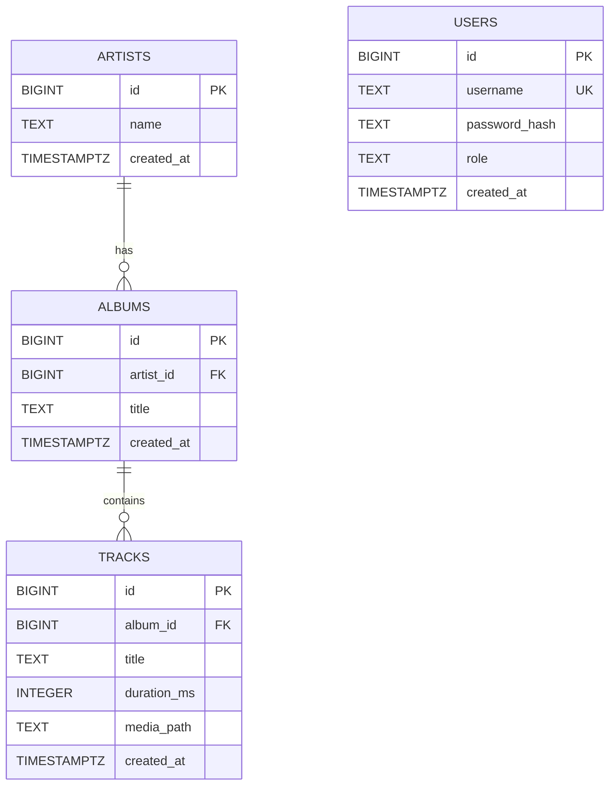

# Soundwave-Live-Version

Soundwave is the CPSC 491-05 Fall 2026 capstone implementation of the
Soundwave music-streaming application.

This repository contains the shared Soundwave application. Development
is completed on individual development branches and integrated into
`main` through peer-reviewed pull requests.

------------------------------------------------------------------------

## Team

-   Christian McGowan

-   Allison Yu

-   Emmanuel De Guzman

-   Matthew Choi

-   Konner Rigby

**Course:** CPSC 491-05\
**Semester:** Fall 2026

------------------------------------------------------------------------

# 1. Current Technology Stack

The current merged Sprint 2 implementation uses:

  ---------------------------------------------------------------------
  Area                               Technology
  ---------------------------------- ----------------------------------
  Backend                            Node.js

  Backend Language                   JavaScript

  Backend HTTP                       Node.js built-in HTTP server

  Backend Tests                      Node.js built-in test runner

  Frontend                           React

  Frontend Language                  JavaScript / JSX

  Frontend Build Tool                Vite

  Frontend Routing                   React Router

  Frontend Styling                   CSS and shared design tokens

  Frontend Tests                     Vitest, React Testing Library,
                                     jest-dom, jsdom

  Packaging                          Docker

  Multi-Service Orchestration        Docker Compose

  Self-Host Verification             Node-based Docker Compose smoke
                                     test

  Source Control                     Git / GitHub

  CI                                 GitHub Actions (server, client,
                                     database, authentication-security,
                                     build-metadata, Docker Packaging,
                                     and Compose Runtime Smoke checks)

  Database                           PostgreSQL

  Search Indexing                    PostgreSQL `pg_trgm` + GIN trigram
                                     indexes

  Build Traceability                 `build-info.json` with
                                     `s2.<run_number>+<short_sha>`
                                     build identity

  PostgreSQL Client                  `pg`

  Password Hashing                   Argon2id via `argon2`

  Access Tokens                      JWT via `jsonwebtoken`

  Audio Playback                     Howler (`howler`)

  music-metadata                     Metadata grabbing

  Packaging / Self-host Setup        Docker, Docker Compose, Node.js
                                     smoke-test tooling
  ---------------------------------------------------------------------

\*\*\*\*\*\*Tailwind CSS is not being used.\*\*\*\*\*\*

The repository will continue to expand as later-sprint implementations
are merged.

------------------------------------------------------------------------

# 2. Quick Start

A new developer should be able to use the instructions below to clone
the repository, install dependencies, start the frontend and backend,
verify the backend, and run the currently available checks.

## 2.1 Clone the Repository

From a WSL/Linux terminal:

``` bash

cd ~

git clone https://github.com/CPSC-491-Soundwave/Soundwave-Live-Version.git

cd Soundwave-Live-Version
```

Verify that the repository was cloned successfully:

``` bash

pwd

git status

git branch --show-current
```

The branch should initially be:

``` text

main
```

------------------------------------------------------------------------

## 2.2 Install Client Dependencies

From the repository root:

``` bash

cd client

npm ci
```

The client contains a committed `package-lock.json`, so `npm ci` should
be used for a clean and reproducible installation.

Return to the repository root:

``` bash

cd ..
```

------------------------------------------------------------------------

## 2.3 Start the Backend

The shared backend requires PostgreSQL configuration and `JWT_SECRET` at
startup.

Before starting the server:

1.  PostgreSQL should be running.

2.  Development migrations should already be applied.

3.  `server/.env` should exist locally with the required development
    values.

4.  Server dependencies should be installed.

From the repository root:

``` bash

cd server

npm ci
```

Create `server/.env` if it does not already exist:

``` dotenv

PGHOST=localhost

PGPORT=5432

PGUSER=soundwave_app

PGPASSWORD=<your-local-postgres-password>

PGDATABASE=<your-development-database>

JWT_SECRET=<development-only-secret>
```

Do not commit `server/.env` or any real secret values.

Start the backend with the environment file loaded explicitly:

``` bash

node --env-file=.env src/server.js
```

Expected output:

``` text

Soundwave API listening on http://localhost:8080
```

Leave this terminal running.

If the required variables are already exported in the current shell, the
normal npm command can also be used:

``` bash

npm start
```

For example, from the repository root:

``` bash

set -a

source database/.env

source server/.env

set +a

cd server

npm start
```

If startup fails with:

``` text

A valid secretKey string is required to initialize the token service.
```

the server did not receive a valid `JWT_SECRET`.

------------------------------------------------------------------------

## 2.4 Start the Client

Open a second WSL/Linux terminal.

Move into the project:

``` bash

cd ~/Soundwave-Live-Version/client
```

Start the Vite development server:

``` bash

npm run dev
```

Vite will print the local development URL in the terminal.

Open the URL shown by Vite in a browser.

Leave this terminal running while using the client.

------------------------------------------------------------------------

## 2.5 Verify the Backend

Open another terminal and run:

``` bash

curl -i http://localhost:8080/health
```

Expected response:

``` text

HTTP/1.1 200 OK

Content-Type: application/json
```

Expected JSON body:

``` json

{"status":"ok"}
```

The `/health` endpoint is intentionally public.

It currently verifies that the Soundwave Node.js backend process is
alive and responding to HTTP requests.

------------------------------------------------------------------------

## 2.6 Verify Unknown-Route Handling

With the backend running:

``` bash

curl -i http://localhost:8080/not-real
```

Expected response:

``` text

HTTP/1.1 404 Not Found
```

Expected JSON body:

``` json

{"error":"not_found"}
```

------------------------------------------------------------------------

## 2.7 Run Backend Tests

From the repository root:

``` bash

cd server

npm test
```

The current backend test suite verifies:

-   `GET /health` returns HTTP `200`.

-   `/health` returns the expected JSON response.

-   Unknown routes return HTTP `404`.

-   Artist catalog repository and service behavior.

-   Artist browse/detail HTTP success, invalid-ID, missing-resource, and
    controlled-failure behavior.

-   Album catalog repository and service behavior.

-   Album browse/detail HTTP success, invalid-ID, missing-resource, and
    controlled-failure behavior.

-   Track detail metadata HTTP success, invalid-ID, missing-resource,
    and controlled-failure behavior.

-   Media streaming full-file `200`, byte-range `206`, invalid-range
    `416`, unknown-track `404`, and missing-media behavior.

-   Metadata extraction and Track persistence behavior.

Verified Sprint 2 result:

``` text

tests 135

suites 12

pass 135

fail 0

cancelled 0

skipped 0

todo 0
```

------------------------------------------------------------------------

## 2.8 Verify the Client

From the repository root:

``` bash

cd client
```

Run ESLint:

``` bash

npm run lint
```

Build the production client:

``` bash

npm run build
```

Both commands should complete successfully before a client-related pull
request is submitted.

The client defines automated shell component tests, Sprint 2
Artist/Album browse-detail tests, and Sprint 2 catalog Search page
tests.

Run:

``` bash
npm run test:run
```

The tests cover the Sidebar navigation/Recently Played shell region,
ArtistCard, AlbumCard, Artist browse/detail behavior, Album
browse/detail behavior, grouped catalog Search behavior, profile/library
behavior, and the integrated playback flow.

Playback coverage includes the empty state, Track metadata loading and
display, Play/Pause interaction, volume updates, controlled metadata
errors, Howl cleanup, and Album Detail Track selection.

------------------------------------------------------------------------

# 3. Prerequisites

Before working with Soundwave, install:

-   Git

-   Node.js 20.x

-   npm

-   Visual Studio Code or another editor

-   WSL/Linux if following the documented development environment

The current project has been successfully run with:

``` text

Node.js v20.20.1

npm 11.11.1
```

## 3.1 Verify Git

``` bash

git --version
```

## 3.2 Verify Node.js

``` bash

node --version
```

## 3.3 Verify npm

``` bash

npm --version
```

## 3.4 Verify Git Identity

Course work must be attributable to the developer who authored it.

Check your configured identity:

``` bash

git config user.name

git config user.email
```

If the repository-specific identity needs to be configured:

``` bash

git config user.name "Your Name"

git config user.email "your-email@example.com"
```

Use the same named GitHub identity throughout the semester.

------------------------------------------------------------------------

# 4. Open the Project in Visual Studio Code

From the repository root:

``` bash

cd ~/Soundwave-Live-Version

code .
```

If the repository was cloned somewhere else, navigate to that location
instead.

------------------------------------------------------------------------

# 5. Install and Use `tree`

The `tree` utility is useful for inspecting the repository without
opening every directory manually.

Check whether it is installed:

``` bash

tree --version
```

If it is not installed on Ubuntu/WSL:

``` bash

sudo apt update

sudo apt install tree
```

From the Soundwave repository root, display the project while excluding
Git metadata, Node dependencies, and build output:

``` bash

tree -I 'node_modules|.git|build'
```

------------------------------------------------------------------------

# 6. Current Repository Structure

The repository is organized by application subsystem, shared
documentation, media fixtures, testing, and deployment tooling.

Ignored dependency directories such as `node_modules/` and generated
client build output such as `client/dist/` are intentionally omitted
from this tree.

``` text
.
├── client
│   ├── Dockerfile
│   ├── eslint.config.js
│   ├── index.html
│   ├── package.json
│   ├── package-lock.json
│   ├── public
│   │   ├── favicon.svg
│   │   └── icons.svg
│   ├── README.md
│   ├── src
│   │   ├── App.css
│   │   ├── App.jsx
│   │   ├── assets
│   │   │   ├── hero.png
│   │   │   ├── react.svg
│   │   │   └── vite.svg
│   │   ├── components
│   │   │   ├── AlbumCard.jsx
│   │   │   ├── AlbumCard.test.jsx
│   │   │   ├── ArtistAlbumCards.css
│   │   │   ├── ArtistCard.jsx
│   │   │   ├── ArtistCard.test.jsx
│   │   │   ├── BackendStatus.css
│   │   │   ├── BackendStatus.jsx
│   │   │   ├── PlaybackBar.css
│   │   │   ├── PlaybackBar.jsx
│   │   │   ├── PlaybackBar.test.jsx
│   │   │   ├── Sidebar.css
│   │   │   ├── Sidebar.jsx
│   │   │   └── Sidebar.test.jsx
│   │   ├── index.css
│   │   ├── main.jsx
│   │   ├── pages
│   │   │   ├── AlbumDetail.jsx
│   │   │   ├── AlbumDetail.test.jsx
│   │   │   ├── Albums.jsx
│   │   │   ├── Albums.test.jsx
│   │   │   ├── ArtistAlbumBrowse.css
│   │   │   ├── ArtistAlbumDetail.css
│   │   │   ├── ArtistDetail.jsx
│   │   │   ├── ArtistDetail.test.jsx
│   │   │   ├── Artists.jsx
│   │   │   ├── Artists.test.jsx
│   │   │   ├── CatalogDebug.jsx
│   │   │   ├── Home.jsx
│   │   │   ├── Library.css
│   │   │   ├── Library.jsx
│   │   │   ├── Library.test.jsx
│   │   │   ├── Login.jsx
│   │   │   ├── Profile.jsx
│   │   │   ├── Profile.test.jsx
│   │   │   ├── Search.css
│   │   │   ├── Search.jsx
│   │   │   └── Search.test.jsx
│   │   ├── playback
│   │   │   └── playback.js
│   │   ├── styles
│   │   │   ├── login.css
│   │   │   ├── profile.css
│   │   │   └── tokens.css
│   │   └── test
│   │       └── setup.js
│   └── vite.config.js
├── compose.yml
├── CONTRIBUTING.md
├── database
│   ├── migrate.js
│   ├── migrations
│   │   ├── 20260915_ayu_001_catalog_core.sql
│   │   ├── 20260916_ayu_002_auth_users.sql
│   │   ├── 20260924_edg_001_user_preferences.sql
│   │   ├── 20260927_cmg_001_catalog_search_support.sql
│   │   └── trackMediaPath.sql
│   ├── package.json
│   ├── package-lock.json
│   ├── seed.js
│   ├── seeds
│   │   └── 20260915_ayu_catalog_seed.sql
│   └── test
│       ├── catalog-db.integration.test.js
│       └── catalog-integrity.test.js
├── docs
│   ├── account-profile.md
│   ├── catalog-fixtures.md
│   ├── catalog-media-boundary.md
│   ├── compose-runtime-smoke-test.md
│   ├── library-recently-added.md
│   ├── pr-review-checklist.md
│   ├── self-host-setup.md
│   ├── sprint1-integration-contracts.md
│   ├── sprint2-build-version-contract.md
│   ├── sprint2-christian-baseline-and-boundaries.md
│   ├── sprint2-christian-cicd-analysis.md
│   └── sprint2-search-api-and-test-notes.md
├── mediaFiles
│   ├── license.txt
│   └── test.mp3
├── output.txt
├── playback
│   ├── package.json
│   ├── package-lock.json
│   ├── playbackDoc
│   │   ├── metadataDocumentation.md
│   │   ├── playbackDocumentation.md
│   │   └── testingDocumentation.md
│   ├── playback.js
│   └── testers
│       ├── index.html
│       └── server.js
├── README.md
├── scripts
│   ├── compose-smoke-test.mjs
│   └── generate-build-info.mjs
├── server
│   ├── Dockerfile
│   ├── package.json
│   ├── package-lock.json
│   ├── src
│   │   ├── account
│   │   │   └── profile.js
│   │   ├── app.js
│   │   ├── auth
│   │   │   ├── auth-documentation
│   │   │   │   ├── auth_ADR.md
│   │   │   │   ├── AUTHCONFIG.md
│   │   │   │   ├── auth_threat_model.md
│   │   │   │   └── media-auth-requirements.md
│   │   │   ├── auth.js
│   │   │   ├── hasher.js
│   │   │   ├── login.js
│   │   │   ├── me.js
│   │   │   └── token.js
│   │   ├── catalog
│   │   │   ├── catalog.handler.js
│   │   │   └── catalog.service.js
│   │   ├── data
│   │   │   ├── account-profile.repository.js
│   │   │   ├── auth-user.repository.js
│   │   │   ├── catalog.repository.js
│   │   │   └── search.repository.js
│   │   ├── media
│   │   │   ├── metadata.js
│   │   │   └── streaming.js
│   │   ├── search
│   │   │   ├── search.handler.js
│   │   │   └── search.service.js
│   │   └── server.js
│   └── test
│       ├── account-profile.repository.test.js
│       ├── account-profile-routes.test.js
│       ├── auth-routes.test.js
│       ├── auth.test.js
│       ├── catalog-albums.repository.test.js
│       ├── catalog-albums-routes.test.js
│       ├── catalog-albums.service.test.js
│       ├── catalog-artists.repository.test.js
│       ├── catalog-artists-routes.test.js
│       ├── catalog-artists.service.test.js
│       ├── catalog-media-contract.test.js
│       ├── catalog-repository.test.js
│       ├── catalog-routes.test.js
│       ├── catalog-track-detail.test.js
│       ├── hasher.test.js
│       ├── health.test.js
│       ├── library-recently-added-routes.test.js
│       ├── login.test.js
│       ├── media-streaming.test.js
│       ├── metadata.test.js
│       ├── me.test.js
│       ├── search.repository.test.js
│       ├── search-routes.test.js
│       ├── search.service.test.js
│       ├── token.test.js
│       └── track-persistence.test.js
└── SOUNDWAVE_LOCAL_AUTH_INSTRUCTIONS.md
```

Local-only `.env` files, `node_modules/`, generated build output, and
operating-system metadata are intentionally omitted.

The exact structure will continue to evolve as later sprint work is
merged.

------------------------------------------------------------------------

# 7. Backend Setup --- Christian McGowan

The current Soundwave backend uses:

-   Node.js

-   JavaScript

-   ES modules

-   Node.js built-in HTTP server

-   Node.js built-in test runner

The backend is located in:

``` text

server/
```

------------------------------------------------------------------------

# 8. Backend Commands

## 8.1 Enter the Backend Directory

From the repository root:

``` bash

cd server
```

Verify:

``` bash

pwd
```

The path should end with:

``` text

/Soundwave-Live-Version/server
```

------------------------------------------------------------------------

## 8.2 Inspect Backend Configuration

``` bash

cat package.json
```

Current configuration:

``` json

{

  "name": "soundwave-server",

  "version": "0.1.0",

  "private": true,

  "type": "module",

  "description": "Soundwave backend server",

  "scripts": {

    "start": "node src/server.js",

    "dev": "node --watch src/server.js",

    "test": "node --test"

  }

}
```

The backend uses Node.js built-in modules together with external
packages.

Current backend authentication dependencies include:

| Package \| Purpose \|

| --- \| --- \|

| `argon2` \| Argon2id password hashing and password verification \|

| `jsonwebtoken` \| Signed access-token creation and verification \|

------------------------------------------------------------------------

## 8.3 Start the Backend

The recommended local-development startup command is:

``` bash

node --env-file=.env src/server.js
```

This loads the PostgreSQL settings and `JWT_SECRET` from `server/.env`.

Expected output:

``` text

Soundwave API listening on http://localhost:8080
```

If the required variables are already exported in the current shell,
this also works:

``` bash

npm start
```

------------------------------------------------------------------------

## 8.4 Development Watch Mode

Because the current `npm run dev` script does not load `server/.env`
automatically, export the environment first:

``` bash

set -a

source .env

set +a

npm run dev
```

Node will restart the backend when watched source files change.

Stop the process with:

``` text

Ctrl+C
```

------------------------------------------------------------------------

## 8.5 Run Backend Tests

``` bash

npm test
```

Verified Sprint 2 result:

``` text

tests 135

suites 12

pass 135

fail 0

cancelled 0

skipped 0

todo 0
```

The durable requirement is `fail 0` because later sprints may add more
tests.

------------------------------------------------------------------------

## 8.6 Run on Another Port

The backend defaults to port `8080`.

To use another port while loading `server/.env`:

``` bash

PORT=8081 node --env-file=.env src/server.js
```

Verify it:

``` bash

curl -i http://localhost:8081/health
```

------------------------------------------------------------------------

# 9. Client Setup --- Konner Rigby

Konner Rigby owns the Sprint 1 client-shell and self-host packaging
implementation. In Sprint 2, Konner extends that ownership with the
authenticated Library recently-added integration and Docker/Compose CI
automation.

Completed Sprint 1 client/self-host work includes:

-   React/Vite application scaffold
-   React Router application routing
-   persistent application shell
-   sidebar navigation
-   persistent playback region
-   shared CSS design tokens
-   backend-health status integration
-   shell component tests
-   client Docker packaging
-   Docker Compose client/server integration
-   automated Compose smoke testing
-   self-host setup documentation
-   pull-request review checklist

Completed Sprint 2 Library/CI work includes:

-   authenticated recently-added Library browsing

-   Library loading, empty, unauthorized, and error states

-   Library Track selection through the shared `selectedTrackId`
    playback seam

-   Library integration contract documentation

-   Docker Compose configuration validation in GitHub Actions

-   server and client Docker image builds in GitHub Actions

-   shared build-version metadata consumption for container images

-   Compose runtime smoke testing in GitHub Actions with disposable
    CI-only configuration

-   Compose runtime configuration contract documentation

The current client uses:

-   React
-   React DOM
-   React Router
-   JavaScript / JSX
-   Vite
-   ESLint
-   CSS
-   shared CSS design tokens
-   Vitest
-   React Testing Library
-   jest-dom
-   jsdom

The team is **not using Tailwind CSS**.

The client is located in:

``` text
client/
```

------------------------------------------------------------------------

# 10. Client Commands

## 10.1 Enter the Client Directory

From the repository root:

``` bash

cd client
```

------------------------------------------------------------------------

## 10.2 Install Client Dependencies

For a fresh clone:

``` bash

npm ci
```

`npm ci` uses the committed `package-lock.json` and installs the exact
dependency versions represented by the lockfile.

------------------------------------------------------------------------

## 10.3 Inspect Available Client Scripts

``` bash

npm run
```

The current client scripts are:

``` text
dev
build
lint
preview
test
test:run
```

The relevant `package.json` scripts are:

``` json

{

  "scripts": {

    "dev": "vite",

    "build": "vite build",

    "lint": "eslint .",

    "preview": "vite preview",
    "test": "vitest",
    "test:run": "vitest run"
  }

}
```

------------------------------------------------------------------------

## 10.4 Start the Client Development Server

``` bash

npm run dev
```

Vite will print the local URL in the terminal.

Open that URL in a browser.

Stop the development server with:

``` text

Ctrl+C
```

------------------------------------------------------------------------

## 10.5 Run Client Linting

``` bash

npm run lint
```

Linting should complete successfully before submitting client changes
for review.

------------------------------------------------------------------------

## 10.6 Build the Client

``` bash

npm run build
```

Vite will produce the production build output.

The generated build directory should not be manually edited or committed
unless the team explicitly changes that policy.

------------------------------------------------------------------------

## 10.7 Preview the Production Build

After running:

``` bash

npm run build
```

start the Vite preview server:

``` bash

npm run preview
```

Vite will display the preview URL in the terminal.

Open the displayed URL in a browser.

Stop it with:

``` text

Ctrl+C
```

------------------------------------------------------------------------

# 11. Run the Current Application Locally

The current frontend and backend run as separate development processes.

Before starting the backend, make sure PostgreSQL is running, the
development migrations have been applied, and `server/.env` exists
locally.

## Terminal 1 --- Backend

``` bash

cd ~/Soundwave-Live-Version/server

npm ci

node --env-file=.env src/server.js
```

Expected:

``` text

Soundwave API listening on http://localhost:8080
```

If the environment variables are already exported in this terminal,
`npm start` may be used instead.

## Terminal 2 --- Client

``` bash

cd ~/Soundwave-Live-Version/client

npm ci

npm run dev
```

Open the URL printed by Vite.

## Terminal 3 --- Backend Verification

``` bash

curl -i http://localhost:8080/health
```

Expected:

``` json

{"status":"ok"}
```

Also verify the backend's `404` behavior:

``` bash

curl -i http://localhost:8080/not-real
```

Expected:

``` json

{"error":"not_found"}
```

The client shell and backend remain independently runnable. The Sprint 2
Artist and Album browse/detail slice is now integrated end-to-end
through PostgreSQL-backed catalog APIs, while other application features
continue to be developed incrementally.

------------------------------------------------------------------------

# 12. Full Current Verification

Before submitting changes that affect the existing database, client,
backend, or CI workflow, run the relevant checks.

## Database

``` bash

cd ~/Soundwave-Live-Version/database

npm run db:migrate:test
npm run db:migrate:test
npm run db:seed:test
npm run test:integrity
npm run test:db
```

The second migration run is the local equivalent of the CI migration
preflight and should safely skip already-applied migrations.

Verified Sprint 2 integrity-gate result:

``` text

tests 2
pass 2
fail 0
```

Verified Sprint 2 database integration result:

``` text

tests 31
pass 31
fail 0
```

## Backend

``` bash

cd ~/Soundwave-Live-Version/server

npm test
```

## Client Lint

``` bash

cd ~/Soundwave-Live-Version/client

npm run lint
```

## Client Build

``` bash

npm run build
```

A healthy current checkout should have:

``` text

Backend tests: PASS
Client tests:  PASS
Database tests: PASS
Client lint:   PASS
Client build:  PASS
```

## 12.1 GitHub Actions CI

The Sprint 2 CI workflow runs on pull requests to `main` and pushes to
`main`.

Current checks are:

``` text
Authentication Security
Build Metadata
Client Build
Client Lint
Client Tests
Compose Runtime Smoke Test
Database Tests
Docker Packaging
Server Tests
```

Sprint 2 added `Client Tests`, PostgreSQL-backed `Database Tests`, and
`Build Metadata` to the existing workflow.

The current verified local test totals are:

``` text
Server:   135 passed, 0 failed
Client:    42 passed, 0 failed
Database:  31 passed, 0 failed
```

The `Build Metadata` job generates:

``` text
artifacts/build-info.json
```

Build identity format:

``` text
s2.<run_number>+<short_sha>
```

The metadata records the full commit SHA, short SHA, GitHub Actions run
number, run ID, branch/ref, event name, and UTC generation timestamp.

The `Build Metadata` job also exposes the generated version as:

``` text
job output: version
environment: SOUNDWAVE_BUILD_VERSION
```

A verification step confirms that the exported values match the
generated `build-info.json` version.

Pull-request runs validate metadata generation. Pushes to `main`
additionally upload the build metadata as a GitHub Actions artifact
named:

``` text
soundwave-build-info-<run_number>
```

The artifact is retained for 30 days.

Build metadata must never contain JWT secrets, database passwords,
tokens, private keys, or user data.

Detailed contract:

``` text
docs/sprint2-build-version-contract.md
```

Verified hosted Sprint 2 build evidence includes:

``` text
main build identity: s2.147+78ed45f
main artifact: soundwave-build-info-147.zip
final export verification: s2.149+c2f90e3
```

GitHub Actions now enforces server tests, client tests, client lint,
client build, database integration tests, authentication-security
checks, build-metadata generation, Docker packaging validation, and
Compose runtime smoke verification.

Allison Yu's Sprint 2 database CI hardening extends the existing
`Database Tests` job with two additional fail-fast checks:

``` text
Run database migrations
    ↓
Verify database migration rerun is safe
    ↓
Seed database test fixtures
    ↓
Verify database schema and fixture integrity
    ↓
Run database integration tests
```

The migration preflight reruns `npm run db:migrate:test` against the same
ephemeral CI database and requires already-applied migrations to be
safely skipped. This behavior has been peer-reviewed and merged.

The schema/fixture integrity gate is implemented through:

``` text
database/test/catalog-integrity.test.js
npm run test:integrity
```

It verifies the stable Artist -> Album -> Track schema contract,
relationship foreign keys, relationship indexes, and deterministic
fixture identities/relationships before the broader database integration
suite runs. The gate intentionally does not require exact total table
row counts, so later valid fixture additions do not fail CI simply
because the catalog grows.

Verified local integrity-gate result:

``` text
tests 2
pass 2
fail 0
```

The `Docker Packaging` job validates the Compose configuration, builds
the server and client Docker images, consumes the shared
`SOUNDWAVE_BUILD_VERSION`, uses a Docker-safe image tag when required,
and verifies the shared build version in image metadata.

The `Compose Runtime Smoke Test` job reuses:

``` text
scripts/compose-smoke-test.mjs
```

with disposable CI-only PostgreSQL and JWT configuration. The smoke path
starts the Compose services, verifies backend `/health`, verifies that
unauthenticated access to `/api/library/recently-added` returns HTTP
`401`, verifies client availability, fails CI on runtime errors, and
cleans up Compose containers and networks.

Konner's Sprint 2 CI/runtime contracts are documented in:

``` text
docs/compose-runtime-smoke-test.md
docs/library-recently-added.md
```

------------------------------------------------------------------------

# 13. Database Setup --- Allison Yu

Allison Yu owns the Sprint 1 catalog-data/database foundation.

Once that implementation is merged into `main`, this section should
include exact commands for:

Sprint 1 establishes the PostgreSQL catalog-data foundation, migration
tooling,

deterministic catalog seed, database integration tests, and
authentication

persistence boundary.

## Soundwave Database Setup

## Purpose

The root-level `database/` package contains Soundwave's PostgreSQL
migration, seed, and database-test tooling.

It currently provides:

-   Catalog schema for `artists`, `albums`, and `tracks`

-   Authentication persistence schema for `users`

-   Deterministic catalog seed data

-   Development and test migration commands

-   Database migration-rerun preflight coverage in CI

-   A focused schema/fixture integrity gate for stable catalog contracts

-   Database integration tests

-   A runtime authentication-user repository under `server/src/data/`

Shared server startup wiring is intentionally not included here. The
database and repository are ready for feature owners to consume without
changing `server.js`.

------------------------------------------------------------------------

# 14. Repository Structure

The repository has one canonical structure tree in [Section 6: Current
Repository Structure](#6-current-repository-structure).

That tree intentionally omits `node_modules/`, generated build output,
local `.env` files, and other ignored/local-only files.

------------------------------------------------------------------------

# 15. Install Dependencies

The repository uses separate Node packages for the client, server, and
database tooling.

## Client

``` bash

cd client

npm ci

cd ..
```

## Server

``` bash

cd server

npm ci

cd ..
```

## Database

``` bash

cd database

npm ci

cd ..
```

Do not commit any `node_modules/` directory.

------------------------------------------------------------------------

# 16. PostgreSQL Database Setup

The root-level `database/` package contains Soundwave's PostgreSQL
migration, seed, and database-test tooling.

It currently provides:

-   `artists`

-   `albums`

-   `tracks`

-   `users`

-   `schema_migrations`

-   deterministic catalog fixtures

-   development and test migration commands

-   development and test seed commands

-   database integration tests

-   Sprint 2 catalog-search support through `pg_trgm` and GIN trigram
    indexes

The browser/client must never connect directly to PostgreSQL.

## 16.1 PostgreSQL Role and Databases

Each developer needs:

1.  A PostgreSQL role that can connect to the project databases.

2.  A development database.

3.  A separate test database.

Allison's current local example is:

``` text

Role:           soundwave_app

Development DB: soundwave_allison_dev

Test DB:        soundwave_allison_test

Host:           localhost

Port:           5432
```

Other developers may use different database names. The environment files
control which databases the tooling uses.

Example SQL, run from `psql` as a PostgreSQL administrator:

``` sql

CREATE ROLE soundwave_app

WITH LOGIN

PASSWORD '<choose-a-local-password>';

CREATE DATABASE soundwave_allison_dev

OWNER soundwave_app;

CREATE DATABASE soundwave_allison_test

OWNER soundwave_app;
```

If the role or databases already exist, do not recreate them.

Do not commit the PostgreSQL password.

------------------------------------------------------------------------

# 17. Configure Database Environment Files

## Development database

Create:

``` text

database/.env
```

Example:

``` dotenv

PGHOST=localhost

PGPORT=5432

PGUSER=soundwave_app

PGPASSWORD=<your-local-postgres-password>

PGDATABASE=<your-development-database>
```

Allison's local example uses:

``` dotenv

PGDATABASE=soundwave_allison_dev
```

Do not commit `database/.env`.

## Test database

Create:

``` text

database/.env.test
```

Example:

``` dotenv

PGHOST=localhost

PGPORT=5432

PGUSER=soundwave_app

PGPASSWORD=<your-local-postgres-password>

PGDATABASE=<your-test-database>
```

Allison's local example uses:

``` dotenv

PGDATABASE=soundwave_allison_test
```

The test database must be separate from the development database.

Do not commit `database/.env.test`.

------------------------------------------------------------------------

# 18. Database Commands

All commands below are run from:

``` text

Soundwave-Live-Version/database
```

Available commands:

``` text

npm run db:migrate

npm run db:migrate:test

npm run db:seed

npm run db:seed:test

npm run test:integrity

npm run test:db
```

`npm run test:integrity` runs the focused catalog schema/fixture
integrity gate independently from the broader PostgreSQL integration
suite.

------------------------------------------------------------------------

# 19. Apply Development Migrations

From `database/`:

``` bash

npm run db:migrate
```

Current migrations:

``` text

20260915_ayu_001_catalog_core.sql

20260916_ayu_002_auth_users.sql

20260924_edg_001_user_preferences.sql

20260927_cmg_001_catalog_search_support.sql
```

The migration runner:

1.  Creates `schema_migrations` if it does not exist.

2.  Reads migration files in filename order.

3.  Checks which migrations are already applied.

4.  Skips already-applied migrations.

5.  Runs each new migration inside a transaction.

6.  Records successful migrations in `schema_migrations`.

Running the migration command a second time should safely skip
already-applied migrations.

Sprint 2 CI now verifies this behavior explicitly through the database
migration preflight. The `Database Tests` job applies the migration set,
reruns the same migration command, and requires the second run to
complete successfully without reapplying already-recorded migrations.

Verified Sprint 1 rerun behavior:

``` text

skip 20260915_ayu_001_catalog_core.sql

skip 20260916_ayu_002_auth_users.sql

Database migrations complete.
```

------------------------------------------------------------------------

# 20. Seed the Development Database

From `database/`:

``` bash

npm run db:seed
```

The deterministic catalog seed creates:

``` text

3 artists

3 albums

5 tracks
```

Verified seed behavior:

``` text

Seeding database: soundwave_allison_dev

Reading seed file: .../20260915_ayu_catalog_seed.sql

Catalog seed complete.
```

The seed is intended to be rerunnable without duplicating the known
logical fixtures.

The catalog seed does not create authentication users and does not
contain plaintext passwords.

------------------------------------------------------------------------

# 21. Deterministic Catalog Fixtures

Source of truth:

``` text

database/seeds/20260915_ayu_catalog_seed.sql
```

Shared fixture contract:

``` text

docs/catalog-fixtures.md
```

## Artists

| ID \| Name \|

| ---: \| --- \|

| 1001 \| Fixture Artist One \|

| 1002 \| Fixture Artist Two \|

| 1003 \| Buddha \|

## Albums

| ID \| Title \| Artist ID \|

| ---: \| --- \| ---: \|

| 2001 \| Fixture Album Alpha \| 1001 \|

| 2002 \| Fixture Album Beta \| 1002 \|

| 2003 \| No Copyright \| 1003 \|

## Tracks

| ID \| Title \| Album ID \| Artist ID \| Duration \|

| ---: \| --- \| ---: \| ---: \| ---: \|

| 3001 \| Fixture Track One \| 2001 \| 1001 \| 180000 ms \|

| 3002 \| Fixture Track Two \| 2001 \| 1001 \| 205000 ms \|

| 3003 \| Fixture Track Three \| 2002 \| 1002 \| 195000 ms \|

| 3004 \| Fixture Track Four \| 2002 \| 1002 \| 222000 ms \|

| 3005 \| Kontekst \| 2003 \| 1003 \| 209136 ms \|

Fixture IDs are stable development/test contracts.

They may be hardcoded in tests, but production feature logic must not
assume fixture IDs such as `3001` always exist.

------------------------------------------------------------------------

# 22. Prepare and Test the Test Database

From `database/`:

``` bash

npm run db:migrate:test

npm run db:migrate:test

npm run db:seed:test

npm run test:integrity

npm run test:db
```

The second migration run verifies rerun safety. The focused integrity
gate verifies the stable catalog contract before the broader database
integration suite.

The integrity gate verifies:

-   required `artists`, `albums`, and `tracks` columns

-   `albums.artist_id -> artists.id`

-   `tracks.album_id -> albums.id`

-   `albums_artist_id_idx`

-   `tracks_album_id_idx`

-   deterministic Artist fixture identities

-   deterministic Album-to-Artist fixture relationships

-   deterministic Track-to-Album fixture relationships and durations

The gate intentionally checks required stable fixtures rather than exact
table row counts, so future valid fixture additions remain compatible.

Verified Sprint 2 integrity-gate result:

``` text

tests 2

pass 2

fail 0
```

The broader database integration suite verifies:

-   dedicated test database usage

-   catalog tables

-   migration history

-   deterministic artist fixtures

-   deterministic album relationships

-   deterministic track relationships

-   catalog joins

-   catalog foreign-key constraints

-   `users` table

-   authentication-user fields

-   role constraints

-   username uniqueness

-   username nonblank behavior

-   password-hash nonblank behavior

-   `pg_trgm` extension availability

-   catalog-search trigram index creation

-   case-insensitive substring-search behavior against deterministic
    fixtures

Verified Sprint 2 database result:

``` text

tests 31

pass 31

fail 0
```

Sprint 2 database verification requirement:

``` text

fail 0
```

A database change should not be submitted if `npm run test:db` reports
any failure.

------------------------------------------------------------------------

# 23. Current Database Schema

Catalog relationship:

``` text

artists

  |

  | 1:N

  v

albums

  |

  | 1:N

  v

tracks
```

Authentication persistence:

``` text

users
```

There is intentionally no Sprint 1 foreign key between `users` and the
catalog tables.

Future user-scoped features such as favorites and playlists should
introduce their own relationship tables through later migrations.

## ERD


``` mermaid

erDiagram

    ARTISTS ||--o{ ALBUMS : has

    ALBUMS ||--o{ TRACKS : contains

    ARTISTS {

        BIGINT id PK

        TEXT name

        TIMESTAMPTZ created_at

    }

    ALBUMS {

        BIGINT id PK

        BIGINT artist_id FK

        TEXT title

        TIMESTAMPTZ created_at

    }

    TRACKS {

        BIGINT id PK

        BIGINT album_id FK

        TEXT title

        INTEGER duration_ms

        TEXT media_path

        TIMESTAMPTZ created_at

    }

    USERS {

        BIGINT id PK

        TEXT username UK

        TEXT password_hash

        TEXT role

        TIMESTAMPTZ created_at

    }
```

`schema_migrations` is migration bookkeeping and is intentionally
omitted from the domain ERD.

------------------------------------------------------------------------

# 24. Migration Convention

Migration filenames use:

``` text

YYYYMMDD_author_sequence_description.sql
```

Examples:

``` text

20260915_ayu_001_catalog_core.sql

20260916_ayu_002_auth_users.sql
```

Rules:

1.  Migrations are forward-only.

2.  Migration files execute in filename order.

3.  A new migration runs inside a transaction.

4.  Successful migrations are recorded in `schema_migrations`.

5.  Already-applied migrations are skipped.

6.  Once a migration is merged and applied, do not edit it to make a
    later schema change.

7.  Create a new migration for every later schema change.

8.  Feature-specific migrations should be authored by the feature owner
    rather than making one teammate the permanent database owner.

Sprint 1 does not implement automatic rollback of previously applied
migrations.

------------------------------------------------------------------------

# 25. Manual Database Verification

Optional verification with `psql`:

``` bash

psql -U soundwave_app -d soundwave_allison_dev
```

Then:

``` sql

SELECT id, name

FROM artists

ORDER BY id;
```

``` sql

SELECT id, artist_id, title

FROM albums

ORDER BY id;
```

``` sql

SELECT id, album_id, title, duration_ms, media_path

FROM tracks

ORDER BY id;
```

Full catalog join:

``` sql

SELECT

    t.id AS track_id,

    t.title AS track_title,

    t.duration_ms,

    t.media_path,

    a.id AS album_id,

    a.title AS album_title,

    ar.id AS artist_id,

    ar.name AS artist_name

FROM tracks t

JOIN albums a

    ON a.id = t.album_id

JOIN artists ar

    ON ar.id = a.artist_id

ORDER BY t.id;
```

Exit with:

``` text

\q
```

------------------------------------------------------------------------

# 26. Server Environment Setup

The shared server uses PostgreSQL-backed repositories and JWT
authentication.

Create:

``` text

server/.env
```

Example:

``` dotenv

PGHOST=localhost

PGPORT=5432

PGUSER=soundwave_app

PGPASSWORD=<your-local-postgres-password>

PGDATABASE=<your-development-database>

JWT_SECRET=<development-only-secret>
```

Do not commit `server/.env`.

Do not commit database passwords, JWT secrets, access tokens, private
keys, or plaintext authentication passwords.

------------------------------------------------------------------------

# 27. Start the Backend

From `server/`:

``` bash

node --env-file=.env src/server.js
```

The backend listens on port `8080` by default.

Expected startup behavior:

``` text

Soundwave API listening on http://localhost:8080
```

If the required environment variables are already exported in the shell,
`npm start` may also be used:

``` bash

npm start
```

Stop with `Ctrl+C`.

------------------------------------------------------------------------

# 28. Verify Backend Health

With the backend running:

``` bash

curl -i http://localhost:8080/health
```

Expected body:

``` json

{"status":"ok"}
```

Unknown routes should return HTTP `404` with:

``` json

{"error":"not_found"}
```

------------------------------------------------------------------------

# 29. Verify the Catalog API

With migrations applied, the database seeded, and the backend running:

``` bash

curl -i http://localhost:8080/api/catalog/tracks
```

Expected status:

``` text

HTTP/1.1 200 OK
```

Expected response shape:

``` json

[

  {

    "id": 3001,

    "title": "Fixture Track One",

    "durationMs": 180000,

    "album": {

      "id": 2001,

      "title": "Fixture Album Alpha"

    },

    "artist": {

      "id": 1001,

      "name": "Fixture Artist One"

    }

  }

]
```

The seeded development database returns five Track records, including
the legally usable media-backed Track `3005`.

The catalog API must not expose local filesystem paths, media storage
paths, storage keys, or media implementation details.

Shared contract:

``` text

docs/catalog-media-boundary.md
```

## 29.1 Verify the Artist Catalog API

With migrations applied, the database seeded, and the backend running:

``` bash

curl -i http://localhost:8080/api/catalog/artists

curl -i http://localhost:8080/api/catalog/artists/1001
```

Expected status for the seeded Artist records:

``` text

HTTP/1.1 200 OK
```

The Artist list returns catalog Artist identity. Artist detail returns
the selected Artist and that Artist's related Albums.

Valid but missing Artist IDs return HTTP `404`. Malformed Artist IDs
return HTTP `400`.

## 29.2 Verify the Album Catalog API

With migrations applied, the database seeded, and the backend running:

``` bash

curl -i http://localhost:8080/api/catalog/albums

curl -i http://localhost:8080/api/catalog/albums/2001
```

Expected status for the seeded Album records:

``` text

HTTP/1.1 200 OK
```

The Album list returns each Album with Artist identity. Album detail
returns the selected Album, its Artist identity, and basic related Track
catalog metadata.

Valid but missing Album IDs return HTTP `404`. Malformed Album IDs
return HTTP `400`.

The Artist and Album catalog responses do not expose local filesystem
paths, storage keys, or media implementation details.

## 29.3 Verify Track Detail and Media Streaming --- Matthew Choi

Sprint 2 integrates Track metadata and media streaming into the real
Soundwave backend.

Track detail endpoint:

``` text
GET /api/catalog/tracks/:id
```

Example using the legal seeded Track:

``` bash
curl -i http://localhost:8080/api/catalog/tracks/3005
```

Expected response includes stable public catalog metadata:

``` json
{
  "id": 3005,
  "title": "Kontekst",
  "durationMs": 209136,
  "album": {
    "id": 2003,
    "title": "No Copyright"
  },
  "artist": {
    "id": 1003,
    "name": "Buddha"
  }
}
```

The public Track metadata response intentionally does not expose
`media_path` or other filesystem/storage implementation details.

Track detail behavior:

``` text
existing Track      -> 200
missing Track       -> 404 track_not_found
malformed Track ID  -> 400 invalid_track_id
repository failure  -> 500 catalog_unavailable
```

Media endpoint:

``` text
GET /api/tracks/:id/stream
```

The media route resolves the stable catalog Track ID to its internal
media resource and supports HTTP byte-range playback.

Automated media coverage verifies:

``` text
full-file request       -> 200
valid byte range        -> 206
invalid byte range      -> 416
unknown Track           -> 404
missing media resource  -> 404
```

Dedicated regression coverage includes:

``` text
server/test/catalog-track-detail.test.js
server/test/media-streaming.test.js
server/test/metadata.test.js
server/test/track-persistence.test.js
```

The old `playback/server.js` test harness is not required by the
production backend path.

------------------------------------------------------------------------

## 29.4 Verify the Sprint 2 Search API --- Christian McGowan

Sprint 2 adds public catalog discovery across tracks, artists, and
albums.

Endpoint:

``` text
GET /api/search?q=<query>&type=<type>
```

Supported `type` values:

``` text
all
track
artist
album
```

If `type` is omitted, `all` is used.

Search rules:

-   `q` is required.
-   Leading and trailing whitespace is trimmed.
-   The query must contain 1-100 characters after trimming.
-   Matching is case-insensitive.
-   Matching uses substring behavior backed by parameterized PostgreSQL
    queries.
-   No-match searches return HTTP `200` with empty grouped arrays.

Example:

``` bash
curl -i "http://localhost:8080/api/search?q=fixture"
```

Expected response shape:

``` json
{
  "query": "fixture",
  "tracks": [],
  "artists": [],
  "albums": []
}
```

Filtered example:

``` bash
curl -i "http://localhost:8080/api/search?q=track&type=track"
```

Invalid query behavior:

``` text
missing q        -> 400 invalid_search_query
blank q          -> 400 invalid_search_query
q > 100 chars    -> 400 invalid_search_query
invalid type     -> 400 invalid_search_type
repository error -> 500 search_unavailable
```

Search is public catalog discovery for Sprint 2 and does not require a
Bearer token.

Search responses use stable catalog IDs, including `tracks.id`, and do
not expose filesystem paths, media paths, storage keys, filenames, media
bytes, or other storage implementation details.

Backend search implementation:

``` text
server/src/data/search.repository.js
server/src/search/search.service.js
server/src/search/search.handler.js
```

------------------------------------------------------------------------

# 30. Run Server Tests

From `server/`:

``` bash

npm test
```

The suite currently covers:

-   authentication route behavior

-   authentication middleware

-   password hashing

-   access tokens

-   `/health`

-   unknown-route behavior

-   catalog/media identity contract

-   catalog storage-isolation contract

-   catalog HTTP success contract

-   catalog HTTP controlled failure behavior

-   catalog route isolation

-   Artist repository queries and service response mapping

-   Artist browse/detail HTTP success, invalid-ID, missing-resource, and
    controlled-failure behavior

-   Album repository queries and service response mapping

-   Album browse/detail HTTP success, invalid-ID, missing-resource, and
    controlled-failure behavior

-   Search repository parameterization and result retrieval

-   Search service mapping, filtering, trimming, and validation

-   `/api/search` grouped success, filter, empty-result, invalid-query,
    invalid-type, failure, and route-isolation behavior

-   Track detail metadata success, invalid-ID, missing-resource, and
    controlled-failure behavior

-   public Track metadata does not expose `media_path`

-   media full-file and HTTP byte-range streaming behavior

-   invalid Range, unknown Track, and missing-media behavior

-   metadata extraction and Track persistence

Verified Sprint 2 result:

``` text

tests 135

suites 12

pass 135

fail 0

cancelled 0

skipped 0

todo 0
```

The durable requirement is `fail 0` because later sprints may add more
tests and change the total count.

------------------------------------------------------------------------

# 31. Start the Client

From `client/`:

``` bash

npm ci

npm run dev
```

Vite will print the local development URL, typically:

``` text

http://localhost:5173/
```

Use the actual port printed by Vite.

The Vite development server proxies:

``` text

/health

/auth

/api
```

The default backend target is:

``` text

http://localhost:8080
```

------------------------------------------------------------------------

# 32. Catalog Debug Browser Proof

With the backend and client running, open:

``` text

http://localhost:5173/catalog-debug
```

Use the actual Vite port if it differs.

Expected page result:

``` text

Catalog Debug

Loaded 5 tracks.
```

Expected rows:

``` text

3001  Fixture Track One    Fixture Artist One  Fixture Album Alpha  180000 ms

3002  Fixture Track Two    Fixture Artist One  Fixture Album Alpha  205000 ms

3003  Fixture Track Three  Fixture Artist Two  Fixture Album Beta   195000 ms

3004  Fixture Track Four   Fixture Artist Two  Fixture Album Beta   222000 ms

3005  Kontekst             Buddha              No Copyright         209136 ms
```

Browser Developer Tools should show:

``` text

GET /api/catalog/tracks

200 OK
```

This proves the Sprint 1 vertical read path:

``` text

PostgreSQL

    ↓

catalog repository

    ↓

catalog service

    ↓

catalog HTTP handler

    ↓

GET /api/catalog/tracks

    ↓

Vite /api proxy

    ↓

CatalogDebug.jsx

    ↓

browser
```

## 32.1 Artist and Album Browser Proof

With PostgreSQL seeded and both the backend and client running, open:

``` text

http://localhost:5173/artists

http://localhost:5173/artists/1001

http://localhost:5173/albums

http://localhost:5173/albums/2001
```

Expected behavior:

``` text

/artists
  -> GET /api/catalog/artists
  -> HTTP 200
  -> renders seeded Artist cards

/artists/1001
  -> GET /api/catalog/artists/1001
  -> HTTP 200
  -> renders the Artist and related Album data

/albums
  -> GET /api/catalog/albums
  -> HTTP 200
  -> renders seeded Album cards

/albums/2001
  -> GET /api/catalog/albums/2001
  -> HTTP 200
  -> renders the Album, Artist identity, and related Track catalog data
```

This verifies the Sprint 2 Artist/Album read path from PostgreSQL
through the catalog repository, service, and HTTP handler to the React
client.

## 32.2 Sprint 2 Search Browser Proof

With PostgreSQL seeded and both the backend and client running, open:

``` text
http://localhost:5173/search
```

Expected initial behavior:

``` text
Search field
All / Tracks / Artists / Albums filter
Search button
Initial prompt
```

Search for:

``` text
fixture
```

with the `All` filter.

The deterministic seed should produce grouped results for:

``` text
Tracks:  4
Artists: 2
Albums:  2
```

Additional browser checks:

``` text
track + Tracks   -> track results only
one + Artists    -> Fixture Artist One
alpha + Albums   -> Fixture Album Alpha
unknown term     -> no-results state
blank input      -> client-side validation message
```

Artist and album results reuse the existing `/artists/:id` and
`/albums/:id` routes.

Track results display stable catalog metadata and duration without
exposing media-storage details.

Browser Developer Tools should show requests such as:

``` text
GET /api/search?q=fixture&type=all
GET /api/search?q=track&type=track
GET /api/search?q=one&type=artist
GET /api/search?q=alpha&type=album
```

with HTTP `200` for valid searches.

------------------------------------------------------------------------

## 32.3 Sprint 2 Library Recently-Added Browser Proof --- Konner Rigby

Sprint 2 adds an authenticated recently-added Library view that consumes
the shared catalog identity and playback selection contracts.

With PostgreSQL seeded and both the backend and client running, log in
with a valid local test account and open:

``` text
http://localhost:5173/library
```

Expected behavior:

``` text
Unauthenticated visit -> Login required state
Authenticated visit   -> GET /api/library/recently-added
Loading request        -> loading state
Empty response         -> explicit empty state
HTTP 401               -> authorization message
Successful response    -> recently-added Track rows
```

Each rendered Track displays its title, Artist, Album, and formatted
duration.

Selecting a Library Track uses the existing shared playback seam:

``` text
Library
    ↓
onSelectTrack(track.id)
    ↓
App.jsx selectedTrackId
    ↓
PlaybackBar
```

The Library does not create a second player or a separate Track
identity. The stable catalog `track.id` is reused by the existing
playback flow.

Detailed integration contract:

``` text
docs/library-recently-added.md
```

------------------------------------------------------------------------

## 32.4 Sprint 2 Integrated Playback Browser Proof --- Matthew Choi

Sprint 2 moves playback out of the Sprint 1 standalone test HTML and
into the real React/Vite application.

Production client flow:

``` text
AlbumDetail
    ↓
onSelectTrack(track.id)
    ↓
App.jsx selectedTrackId
    ↓
PlaybackBar
    ↓
GET /api/catalog/tracks/:id
    ↓
Howler
    ↓
GET /api/tracks/:id/stream
```

With PostgreSQL seeded and both the backend and client running, open the
Album Detail page containing Track `3005` (`Kontekst`).

Verify:

``` text
Track can be selected from Album Detail
PlaybackBar displays Kontekst
PlaybackBar displays Buddha
PlaybackBar displays No Copyright
Play starts real audio
Pause stops playback
Volume control updates playback volume
```

The production playback module is:

``` text
client/src/playback/playback.js
```

It reuses the Sprint 1 Howler behavior while removing the production
dependency on `playback/index.html` and the temporary playback server.
Loading another Track unloads the previous Howl instance before creating
the replacement.

Manual end-to-end playback through the real Soundwave client and
integrated backend has been verified.

------------------------------------------------------------------------

# 33. Verify the Client

From `client/`:

``` bash

npm run test:run
npm run lint
npm run build
```

Verified Sprint 2 result:

``` text

Client tests: 43 passed, 0 failed
Client lint:  PASS
Client build: PASS
```

Sprint 2 client coverage includes `ArtistCard`, `AlbumCard`, `Artists`,
`Albums`, `ArtistDetail`, `AlbumDetail`, `Search`, `Library`, `Profile`,
and `PlaybackBar` tests. Playback tests cover metadata display,
Play/Pause, volume, error handling, cleanup, and Track selection.

The production build completes successfully.

The client uses `npm run test:run` for the automated Vitest suite.

------------------------------------------------------------------------

# 34. Authentication Persistence

The Sprint 1 `users` table contains:

``` text

id

username

password_hash

role

created_at
```

Current constraints include:

-   username is required

-   username cannot be blank

-   username is unique

-   password hash is required

-   password hash cannot be blank

-   role must be `user` or `admin`

The persistence adapter is located at:

``` text

server/src/data/auth-user.repository.js
```

It exposes:

``` text

findUserByUsername(username)
```

Passwords must never be stored as plaintext.

Real authentication testing requires an Argon2 hash generated through
the authentication hashing implementation.

------------------------------------------------------------------------

# 35. Catalog Persistence

The catalog persistence adapter is located at:

``` text

server/src/data/catalog.repository.js
```

Runtime path:

``` text

PostgreSQL

    ↓

catalog.repository.js

    ↓

catalog.service.js

    ↓

catalog.handler.js

    ↓

GET /api/catalog/tracks
GET /api/catalog/artists
GET /api/catalog/artists/:id
GET /api/catalog/albums
GET /api/catalog/albums/:id
GET /api/catalog/tracks/:id
GET /api/tracks/:id/stream
GET /api/search
```

The backend is the only application layer that should directly access
PostgreSQL.

The React client consumes HTTP APIs only.

## 35.1 Sprint 2 Artist and Album Browse / Detail --- Allison Yu

Sprint 2 extends the Sprint 1 PostgreSQL catalog foundation into an
end-to-end Artist and Album browse/detail vertical slice.

Frontend implementation includes:

``` text

client/src/components/ArtistCard.jsx
client/src/components/AlbumCard.jsx
client/src/components/ArtistAlbumCards.css
client/src/pages/Artists.jsx
client/src/pages/ArtistDetail.jsx
client/src/pages/Albums.jsx
client/src/pages/AlbumDetail.jsx
client/src/pages/ArtistAlbumBrowse.css
client/src/pages/ArtistAlbumDetail.css
```

Registered client routes:

``` text

/artists
/artists/:id
/albums
/albums/:id
```

Backend implementation extends the existing catalog repository, service,
and handler rather than introducing a competing backend path.

Artist browse/detail behavior:

``` text

GET /api/catalog/artists
GET /api/catalog/artists/:id
```

Album browse/detail behavior:

``` text

GET /api/catalog/albums
GET /api/catalog/albums/:id
```

Artist detail returns the selected Artist and related Albums. Album
detail returns the selected Album, Artist identity, and basic Track
catalog metadata.

The detail APIs use controlled HTTP behavior:

``` text

existing resource -> 200
valid but missing ID -> 404
malformed ID -> 400
internal catalog failure -> 500 with catalog_unavailable
```

Album detail intentionally does not implement Track Detail navigation,
playback controls, streaming behavior, codec/bitrate information,
filesystem paths, storage keys, or other media-storage implementation
details.

Dedicated Sprint 2 server tests include:

``` text

server/test/catalog-artists.repository.test.js
server/test/catalog-artists.service.test.js
server/test/catalog-artists-routes.test.js
server/test/catalog-albums.repository.test.js
server/test/catalog-albums.service.test.js
server/test/catalog-albums-routes.test.js
```

Verified Sprint 2 full server result:

``` text

tests 130
suites 12
pass 130
fail 0
cancelled 0
skipped 0
todo 0
```

Client verification for this slice uses:

``` bash

cd client
npm run test:run
npm run lint
npm run build
```

`client/dist/` is generated by the Vite build and is ignored by Git.

## 35.1.1 Sprint 2 Database CI Hardening --- Allison Yu

Sprint 2 extends Allison's database foundation into authored CI/DevOps
verification without making Allison the permanent database owner.

The existing PostgreSQL-backed `Database Tests` job is reused rather
than duplicated.

Allison's CI/CD additions are:

``` text
database migration rerun preflight
database schema/fixture integrity gate
```

### Migration preflight

The workflow runs:

``` text
npm run db:migrate:test
npm run db:migrate:test
```

The second execution must complete successfully and skip migrations
already recorded in `schema_migrations`.

This protects the forward-only migration contract without modifying
previously applied migration files.

### Schema/fixture integrity gate

Implementation:

``` text
database/test/catalog-integrity.test.js
npm run test:integrity
```

The gate verifies:

``` text
required artists/albums/tracks columns
albums.artist_id -> artists.id
tracks.album_id -> albums.id
albums_artist_id_idx
tracks_album_id_idx
stable fixture IDs and relationships
```

Verified local result:

``` text
tests 2
pass 2
fail 0
```

The integrity gate checks stable required fixtures rather than exact
table counts. Valid catalog expansion therefore does not fail CI merely
because additional Artists, Albums, or Tracks are added.

No migration, seed, backend, frontend, Search, authentication, or media
implementation is duplicated by this work.

------------------------------------------------------------------------

## 35.2 Sprint 2 Catalog Search --- Christian McGowan

Sprint 2 adds an independently owned search vertical slice while
consuming the shared catalog schema and existing Artist/Album UI
contracts.

Database support:

``` text
database/migrations/20260927_cmg_001_catalog_search_support.sql
```

The migration enables PostgreSQL `pg_trgm` and creates GIN trigram
indexes for:

``` text
artists.name
albums.title
tracks.title
```

Runtime path:

``` text
React Search page
    ↓
GET /api/search
    ↓
search.handler.js
    ↓
search.service.js
    ↓
search.repository.js
    ↓
PostgreSQL
```

Search source files:

``` text
client/src/pages/Search.jsx
client/src/pages/Search.css
server/src/search/search.handler.js
server/src/search/search.service.js
server/src/data/search.repository.js
```

Dedicated regression coverage:

``` text
client/src/pages/Search.test.jsx
server/test/search-routes.test.js
server/test/search.repository.test.js
server/test/search.service.test.js
database/test/catalog-db.integration.test.js
```

The search implementation consumes shared catalog identities and
existing Artist/Album routes rather than duplicating teammate-owned
browse/detail functionality.

------------------------------------------------------------------------

## 35.3 Sprint 2 Track Metadata and Playback Integration --- Matthew Choi

Sprint 2 converts the Sprint 1 playback spike into a production
catalog-driven vertical slice.

Backend implementation:

``` text
server/src/media/metadata.js
server/src/media/streaming.js
server/src/catalog/catalog.handler.js
server/src/catalog/catalog.service.js
server/src/data/catalog.repository.js
```

Client implementation:

``` text
client/src/playback/playback.js
client/src/components/PlaybackBar.jsx
client/src/components/PlaybackBar.test.jsx
client/src/pages/AlbumDetail.jsx
client/src/pages/AlbumDetail.test.jsx
client/src/App.jsx
```

The implementation uses stable `tracks.id` values across persistence,
catalog metadata, client selection, and media streaming. Physical media
paths remain internal to the backend.

Verified client result:

``` text
Test Files: 11 passed
Tests:      42 passed
ESLint:     PASS
Build:      PASS
```

Verified backend result:

``` text
tests 135
pass 135
fail 0
```

Real application playback has also been manually verified.

------------------------------------------------------------------------

## 35.4 Sprint 2 Library Recently-Added Integration --- Konner Rigby

Sprint 2 connects the authenticated Library to the existing catalog and
playback contracts without introducing a competing backend or playback
path.

Backend/API contract:

``` text
GET /api/library/recently-added
```

The route requires Bearer authentication and returns recently-added
catalog Tracks using stable public Track IDs. Missing or invalid
authentication returns HTTP `401`.

Client implementation:

``` text
client/src/pages/Library.jsx
client/src/pages/Library.css
client/src/pages/Library.test.jsx
client/src/App.jsx
```

Runtime selection path:

``` text
GET /api/library/recently-added
    ↓
Library.jsx
    ↓
onSelectTrack(track.id)
    ↓
App.jsx selectedTrackId
    ↓
PlaybackBar
```

Library client coverage verifies login-required, loading, successful,
empty, unauthorized, error, request-cleanup, and Track-selection
behavior.

Detailed contract:

``` text
docs/library-recently-added.md
```

------------------------------------------------------------------------

# 36. Catalog / Media Boundary

The canonical cross-feature catalog track identity is:

``` text

tracks.id
```

The media subsystem owns:

-   resolving `trackId` to an audio resource

-   storage representation

-   file availability

-   byte-range streaming

-   buffering

-   transcoding

-   media-specific errors

-   media-specific authorization behavior

The catalog does not expose local filesystem paths or internal media
storage details.

Full contract:

``` text

docs/catalog-media-boundary.md
```

------------------------------------------------------------------------

# 37. Full Local Startup Sequence

## Terminal 1 - Database

``` bash

cd Soundwave-Live-Version/database

npm ci

npm run db:migrate

npm run db:seed
```

Optional verification:

``` bash

npm run test:db
```

## Terminal 2 - Backend

``` bash

cd Soundwave-Live-Version/server

npm ci

node --env-file=.env src/server.js
```

Leave this terminal running.

## Terminal 3 - Client

``` bash

cd Soundwave-Live-Version/client

npm ci

npm run dev
```

Leave this terminal running.

Open the Vite URL and navigate to:

``` text

/catalog-debug
/artists
/artists/1001
/albums
/albums/2001
/search

Select Track 3005 from Album Detail and verify PlaybackBar metadata and
real audio playback.
```

------------------------------------------------------------------------

# 38. Full Verification Sequence

## Database

``` bash

cd database

npm run db:migrate

npm run db:seed

npm run db:migrate:test

npm run db:migrate:test

npm run db:seed:test

npm run test:integrity

npm run test:db
```

Required integrity-gate result:

``` text

2 passed
0 failed
```

Required database integration result:

``` text

31 passed
0 failed
```

## Server

``` bash

cd server

npm test
```

Required:

``` text

135 passed
0 failed
```

## Client

``` bash

cd client

npm run test:run
npm run lint
npm run build
```

All commands must complete successfully.

## Browser

With backend and client running:

``` text

/catalog-debug
/artists
/artists/1001
/albums
/albums/2001
/search

Select Track 3005 from Album Detail and verify PlaybackBar metadata and
real audio playback.
```

Verify:

``` text

Loaded 5 tracks.
GET /api/catalog/tracks -> HTTP 200
GET /api/catalog/artists -> HTTP 200
GET /api/catalog/artists/1001 -> HTTP 200
GET /api/catalog/albums -> HTTP 200
GET /api/catalog/albums/2001 -> HTTP 200
GET /api/search?q=fixture&type=all -> HTTP 200
```

------------------------------------------------------------------------

# 39. Troubleshooting

## PostgreSQL password / SCRAM error

If Node reports an error similar to:

``` text

SASL: SCRAM-SERVER-FIRST-MESSAGE: client password must be a string
```

verify that:

1.  The process is loading the expected environment file.

2.  `PGPASSWORD` exists.

3.  The environment file is in the package directory from which the
    command is being run.

Database scripts already load `.env` or `.env.test` through package
scripts.

For server runtime, use:

``` bash

node --env-file=.env src/server.js
```

unless the PostgreSQL variables are already exported.

## Migration is skipped

This is expected when a migration is already recorded in
`schema_migrations`.

Do not delete migration-history rows merely to force migrations to
rerun.

Create a new migration for later schema changes.

## Catalog page shows an error

Check in this order:

1.  PostgreSQL is running.

2.  Development migrations are applied.

3.  Development seed completed.

4.  Backend is running on port `8080`.

5.  `GET http://localhost:8080/api/catalog/tracks` returns HTTP `200`.

6.  Vite is running.

7.  Browser is using `/catalog-debug`.

8.  Network panel shows `/api/catalog/tracks`.

Do not hardcode `http://localhost:8080` into `CatalogDebug.jsx`.

Use the relative path:

``` text

/api/catalog/tracks
```

through the Vite development proxy.

## Search page shows an error or no expected results

Check in this order:

1.  PostgreSQL is running.
2.  `20260927_cmg_001_catalog_search_support.sql` has been applied.
3.  The deterministic catalog seed has been loaded.
4.  The backend is running.
5.  `GET /api/search?q=fixture` returns HTTP `200`.
6.  Vite is running and proxying `/api`.
7.  The browser is using `/search`.
8.  The Network panel shows the expected `/api/search` request.

For a valid but unmatched query, the correct API behavior is HTTP `200`
with empty `tracks`, `artists`, and `albums` arrays.

------------------------------------------------------------------------

# 40. Authentication Setup --- Emmanuel De Guzman

Emmanuel De Guzman owns the Sprint 1 login and identity/authentication
spike.

The authentication implementation is currently being developed on
Emmanuel's

development branch. Much of what is required of it, such as a hasher,
token manager, verifiers, identity handlers, request handlers and login
requests have been merged into `main`

Current authentication work includes:

-   Argon2id password hashing and password verification;

-   signed JWT access-token creation and verification;

-   short-lived access-token expiration;

-   Bearer-token request authentication;

-   validation of supported authentication roles;

-   backend authentication tests using Node.js `node:test`.

## 40.1 Authentication Dependencies

The current authentication implementation uses the following external
Node.js

packages:

| Package \| Purpose \|

| --- \| --- \|

| `argon2` \| Argon2id password hashing and password verification \|

| `jsonwebtoken` \| JWT creation, signing, and verification \|

These dependencies are currently required by Emmanuel's authentication
branch.

They are within the server directory, under /src/auth. Because they are
now within the server directory, authentication is ready to be wired
into the next sprint.

## 40.2 Authentication Source Files

The current authentication implementation is organized under:

    server/src/auth 

    login.js for login requests

    me.js for identity handler

    auth.js for request handler

    hasher.js for argon password hasher and verifier

    token.js for token creator and verifier

    server.test

    login.test.js to test login requests

    me.test.js to test identity handler

    auth.test.js to test the request handler

    hasher.test.js to test hasher and verifier

    token.test.js to test token creator and verifier

## 40.3 Authentication Tests

Once the authentication dependencies are installed, run the
authentication

test suite from the server development directory:

``` bash

npm test
```

The latest local authentication test run produced:

``` text

tests 42

pass 42

fail 0
```

## 40.4 Auth Config

The Sprint 1 authentication implementation defines `JWT_SECRET` as the

server-side signing secret for JWT access tokens.

The secret is supplied to:

`createTokenService(secretKey)`

Real signing secrets must not be committed to Git, exposed to the
client,

or written to logs.

The shared backend now reads `JWT_SECRET` during startup and passes it
to

`createTokenService(secretKey)`.

Server startup requires a valid `JWT_SECRET`. The value must be supplied

through the server environment and must not be hardcoded in source
control.

See `AUTHCONFIG.md` for generation, handling, testing, and configuration

details.

# 41. Media and Streaming Setup --- Matthew Choi

Sprint 2 integrates the Sprint 1 media spike into the shared Soundwave
backend.

Current media implementation includes:

-   legal test media stored under `mediaFiles/`
-   source/license documentation in `mediaFiles/license.txt`
-   metadata extraction through `music-metadata`
-   metadata fields for title, artist, album, and duration
-   fallback behavior for missing metadata
-   PostgreSQL-backed Track persistence with `media_path`
-   database-backed Track lookup through `catalog.repository.js`
-   HTTP full-file audio responses
-   HTTP byte-range streaming with `206 Partial Content`
-   invalid-range handling with HTTP `416`
-   missing Track and missing media handling
-   automated metadata, Track persistence, and media-streaming tests

Current media source files:

``` text
mediaFiles/test.mp3
mediaFiles/license.txt
server/src/media/metadata.js
server/src/media/streaming.js
server/test/metadata.test.js
server/test/track-persistence.test.js
server/test/media-streaming.test.js
```

------------------------------------------------------------------------

# 42. Packaging and Self-Hosted Setup --- Konner Rigby

Konner Rigby owns the Sprint 1 client-shell and self-host packaging
implementation and the Sprint 2 Docker/Compose CI automation.

Sprint 1 establishes Docker packaging for the Soundwave client and
backend, Docker Compose orchestration, automated smoke testing, and
self-host setup documentation.

Sprint 2 moves the established packaging checks into GitHub Actions.
`Docker Packaging` validates the Compose configuration and builds both
images using the team's shared build identity.
`Compose Runtime Smoke Test` reuses the existing smoke-test script with
disposable CI-only configuration to validate the running container
stack.

## 42.1 Current Packaging Architecture

``` text
Browser
   |
   | localhost:5173
   v
Client Container
   |
   | /health, /auth, /api
   v
Server Container
   |
   | PostgreSQL connection
   v
Host PostgreSQL
```

Docker Compose currently manages:

-   React/Vite client
-   Node.js backend server

PostgreSQL currently runs on the host machine.

## 42.2 Required Tooling

Verify Docker:

``` bash
docker --version
docker compose version
```

Docker Desktop must be running before starting the Compose stack.
PostgreSQL must also be running and configured according to the database
setup documented elsewhere in this README.

## 42.3 Packaging Files

``` text
client/Dockerfile
server/Dockerfile
compose.yml
scripts/compose-smoke-test.mjs
```

## 42.4 Environment and Networking

Docker Compose consumes the existing local configuration:

``` text
database/.env
server/.env
```

These files contain local credentials and secrets and must not be
committed.

The server container reaches PostgreSQL running on the host through:

``` text
host.docker.internal
```

The client communicates with the backend through:

``` text
http://server:8080
```

## 42.5 Start Soundwave with Docker Compose

From the repository root:

``` bash
docker compose up --build
```

The client is available at:

``` text
http://localhost:5173
```

The backend is available at:

``` text
http://localhost:8080
```

Verify backend health:

``` bash
curl http://localhost:8080/health
```

Expected:

``` json
{"status":"ok"}
```

The client should display `Backend online`.

## 42.6 Stop Soundwave

``` bash
docker compose down
```

## 42.7 Automated Compose Smoke Test

From the repository root:

``` bash
node scripts/compose-smoke-test.mjs
```

The smoke test builds and starts the Compose stack, waits for readiness,
verifies backend health and client availability, reports success or
failure, and cleans up the Compose services.

Successful output includes:

``` text
Backend health check passed.
Client check passed.
Soundwave Compose smoke test passed.
```

## 42.8 Sprint 2 Docker/Compose CI Automation

The shared GitHub Actions workflow includes Konner-owned container
verification through:

``` text
Docker Packaging
Compose Runtime Smoke Test
```

`Docker Packaging` runs Compose configuration validation, builds the
server and client images, and verifies that container metadata preserves
the shared `SOUNDWAVE_BUILD_VERSION`.

`Compose Runtime Smoke Test` creates disposable CI-only PostgreSQL and
JWT configuration and runs:

``` bash
node scripts/compose-smoke-test.mjs
```

The runtime smoke path verifies:

``` text
backend /health
unauthenticated /api/library/recently-added -> HTTP 401
client availability
Compose cleanup
```

Real JWT secrets, database passwords, and local `.env` files are not
committed for CI.

Runtime CI contract:

``` text
docs/compose-runtime-smoke-test.md
```

## 42.9 Supporting Documentation

Detailed self-host setup:

``` text
docs/self-host-setup.md
```

Pull-request review checklist:

``` text
docs/pr-review-checklist.md
```

## 42.10 Sprint 1 Scope

Sprint 1 establishes the initial development/self-host packaging
foundation. Production deployment hardening, clean-machine release
verification, backup/recovery procedures, and final release
configuration remain later-sprint work.

------------------------------------------------------------------------

# 43. Git Development Workflow

Implementation work should be performed on a developer branch rather
than directly on `main`.

## 43.1 Check Current Repository State

``` bash

cd ~/Soundwave-Live-Version

git status

git branch --show-current
```

------------------------------------------------------------------------

## 43.2 Switch to Your Development Branch

``` bash

git switch <your-development-branch>
```

Example:

``` bash

git switch christian-dev
```

------------------------------------------------------------------------

## 43.3 Synchronize With the Latest `main`

Before beginning a new block of work:

``` bash

git fetch origin

git merge origin/main

git status
```

Example complete sequence:

``` bash

cd ~/Soundwave-Live-Version

git switch christian-dev

git fetch origin

git merge origin/main

git status
```

This should also be done after another teammate merges work that your
implementation depends on.

If Git reports a merge conflict, stop and resolve the affected files
before continuing.

Do not blindly overwrite another teammate's changes.

------------------------------------------------------------------------

# 44. Inspect Changes Before Committing

Check status:

``` bash

git status
```

Inspect unstaged changes:

``` bash

git diff
```

Avoid the Git pager if desired:

``` bash

git --no-pager diff
```

Check for whitespace errors:

``` bash

git diff --check
```

No output from `git diff --check` means Git did not detect whitespace
errors.

------------------------------------------------------------------------

# 45. Stage Changes

Stage only files related to the current task.

General form:

``` bash

git add <files>
```

Example:

``` bash

git add README.md
```

Example for backend files:

``` bash

git add server
```

Check staged files:

``` bash

git status
```

View a summary:

``` bash

git diff --cached --stat
```

Inspect the full staged change:

``` bash

git --no-pager diff --cached
```

Check staged whitespace:

``` bash

git diff --cached --check
```

Do not commit until you understand what is staged.

------------------------------------------------------------------------

# 46. Commit Changes

Create a descriptive commit:

``` bash

git commit -m "<descriptive *commit* *message*>"
```

Examples used or planned during Sprint 1:

``` bash

git commit -m "feat: add Node.js backend health check skeleton"
```

``` bash

git commit -m "docs: add complete development setup guide"
```

``` bash

git commit -m "chore: establish pull request workflow"
```

``` bash

git commit -m "ci: add Node.js and client verification checks"
```

Inspect recent commit history:

``` bash

git log --oneline -3
```

------------------------------------------------------------------------

# 47. Push Your Development Branch

Push the current development branch:

``` bash

git push origin <your-development-branch>
```

Example:

``` bash

git push origin christian-dev
```

Then verify:

``` bash

git status
```

A synchronized branch should report approximately:

``` text

On branch <your-development-branch>

Your branch is up to date with 'origin/<your-development-branch>'.

nothing to commit, working tree clean
```

------------------------------------------------------------------------

# 48. Pull Request Workflow

After pushing:

1.  Open the Soundwave GitHub repository.

2.  Select **Pull requests**.

3.  Create a new pull request.

4.  Set the base branch to `main`.

5.  Set the compare branch to your development branch.

6.  Explain what changed.

7.  Explain how the change was tested.

8.  Link the corresponding Jira issue when available.

9.  Request review from at least one teammate.

10. Address review comments.

11. Wait for required checks to pass.

12. Merge only after approval.

The expected integration flow is:

``` text

Developer Branch

       |

       v

Pull Request

       |

       v

Automated Checks

       |

       v

Peer Review

       |

       v

main
```

Direct feature development on `main` should be avoided.

------------------------------------------------------------------------

# 49. Synchronize After a Pull Request Is Merged

After your pull request is merged, update your development branch.

``` bash

cd ~/Soundwave-Live-Version

git switch <your-development-branch>

git fetch origin

git merge origin/main

git status
```

Christian example:

``` bash

cd ~/Soundwave-Live-Version

git switch christian-dev

git fetch origin

git merge origin/main

git status
```

This keeps the development branch synchronized with work merged by other
teammates.

------------------------------------------------------------------------

# 50. Environment and Secrets

Do not commit:

-   passwords;

-   API keys;

-   authentication tokens;

-   private keys;

-   database passwords;

-   personal credentials;

-   production secrets;

-   real `.env` files containing secret values.

Environment-specific configuration should use environment variables or
another team-approved configuration mechanism.

A sanitized `.env.example` may be committed once the complete
environment-variable contract is established.

The current backend already supports:

``` text

PORT
```

Example:

``` bash

PORT=8081 npm start
```

## 50.1 Authentication Environment

The Sprint 1 authentication implementation defines:

    `JWT_SECRET` is the server-side secret used to sign and verify JWT access

    tokens.

The shared backend consumes this environment variable during startup.

`server/src/server.js` reads `JWT_SECRET` and passes it to the token
service.

Startup fails intentionally when a valid signing secret is not supplied.

Real JWT signing secrets must not be committed to Git, exposed to the
client,

or written to logs.

See `AUTHCONFIG.md` for generation, handling, testing, and deferred

configuration details.

------------------------------------------------------------------------

# 51. Sprint 1 Ownership Boundaries

Sprint 1 implementation is divided so teammates can integrate without
creating competing implementations of the same feature.

| Team Member \| Sprint 1 Primary Responsibility \|

| --- \| --- \|

| Christian McGowan \| Walking skeleton, backend health contract,
  CI/delivery workflow \|

| Allison Yu \| Catalog data foundation and deterministic seed \|

| Emmanuel De Guzman \| Login and identity/authentication spike \|

| Matthew Choi \| Media ingest and HTTP Range playback spike \|

| Konner Rigby \| Client shell and self-host packaging \|

Shared integration is expected.

A developer may:

-   consume another teammate's interface;

-   review another teammate's pull request;

-   integrate their own feature with another subsystem.

A developer should not independently implement another teammate's
primary Sprint 1 feature.

------------------------------------------------------------------------

# 52. Current Sprint 1 / Sprint 2 Status

Currently established or merged:

-   GitHub repository
-   individual development branches
-   peer-reviewed PR workflow
-   Node.js + JavaScript backend
-   configurable backend port
-   public `GET /health`
-   backend automated tests
-   React/Vite client scaffold
-   React Router application routing
-   persistent client shell
-   shared CSS design tokens
-   sidebar navigation
-   persistent playback region
-   Home, Library, Login, and Search pages
-   backend-health status integration
-   client shell component tests
-   client Dockerfile
-   server Dockerfile for Compose packaging
-   Docker Compose client/server orchestration
-   automated Compose smoke test
-   self-host setup documentation
-   pull-request review checklist
-   PostgreSQL catalog-data foundation
-   authentication/identity integration

Sprint 2 Christian McGowan additions currently include:

-   PostgreSQL `pg_trgm` search-support migration and GIN indexes
-   `GET /api/search` for tracks, artists, and albums
-   `all`, `track`, `artist`, and `album` filtering
-   grouped React Search page UI
-   search query validation and controlled error behavior
-   parameterized search repository queries
-   stable track-ID / media-storage boundary verification
-   dedicated search repository, service, route, database, and client
    tests
-   Client Tests GitHub Actions gate
-   PostgreSQL-backed Database Tests GitHub Actions gate
-   Build Metadata GitHub Actions check
-   `s2.<run_number>+<short_sha>` build identity
-   `build-info.json` traceability metadata
-   Build Metadata `version` job output
-   `SOUNDWAVE_BUILD_VERSION` workflow environment export
-   hosted build-version export verification
-   build/version contract documentation
-   Search API and test-notes documentation
-   Sprint 2 CI/CD analysis and results documentation

Sprint 2 Allison Yu additions currently include:

-   Artist and Album browse cards
-   Artist and Album browse pages
-   Artist and Album detail pages
-   Artist and Album client routes
-   PostgreSQL-backed Artist browse/detail catalog APIs
-   PostgreSQL-backed Album browse/detail catalog APIs
-   controlled Artist/Album `400`, `404`, and `500` behavior
-   Artist/Album repository, service, route, and client tests
-   Artist/Album relationship and endpoint contract verification
-   Artist/Album catalog/media boundary documentation updates
-   verification of existing Artist -> Album -> Track foreign-key
    constraints and relationship indexes
-   database migration-rerun preflight in the shared `Database Tests`
    GitHub Actions job
-   focused catalog schema/fixture integrity tests
-   `npm run test:integrity` for independent integrity verification
-   schema/fixture integrity CI gate before the broader `test:db` suite

Sprint 2 Konner Rigby additions currently include:

-   authenticated `GET /api/library/recently-added` integration

-   recently-added Library loading, success, empty, unauthorized, and
    error states

-   Library Track selection through the shared application playback seam

-   Library recently-added integration contract documentation

-   Docker Compose configuration validation in GitHub Actions

-   server and client Docker image builds in GitHub Actions

-   shared build identity consumption in container metadata

-   Docker-safe CI image tagging

-   Compose runtime smoke verification in GitHub Actions

-   disposable CI-only PostgreSQL/JWT runtime configuration

-   Compose runtime smoke-test contract documentation

Other Sprint 1 subsystem work may continue to evolve as remaining team
pull requests are merged.

------------------------------------------------------------------------

# 53. Shared README Ownership

The root `README.md` is shared team documentation.

Before modifying it:

``` bash

cd ~/Soundwave-Live-Version

git switch <your-development-branch>

git fetch origin

git merge origin/main

git status
```

To minimize conflicts:

1.  Update only the section relevant to your subsystem where practical.

2.  Do not reorganize or rewrite another teammate's section
    unnecessarily.

3.  Do not document commands that have not actually been verified.

4.  Update commands whenever implementation changes make older
    instructions invalid.

5.  Merge documentation changes regularly instead of allowing large
    conflicting README changes to accumulate.

6.  Each teammate should document the setup and verification commands
    associated with the subsystem they implement.

------------------------------------------------------------------------

# 54. Troubleshooting

## 54.1 `npm` Cannot Find `package.json`

If npm reports an error similar to:

``` text

ENOENT

Could not read package.json
```

check your location:

``` bash

pwd
```

For backend commands, the path should end with:

``` text

/Soundwave-Live-Version/server
```

For client commands, the path should end with:

``` text

/Soundwave-Live-Version/client
```

Inspect the current directory:

``` bash

ls -la
```

------------------------------------------------------------------------

## 54.2 Inspect Backend Files

From the repository root:

``` bash

find server -maxdepth 4 -type f -print | sort
```

Expected current backend files:

``` text

server/package.json

server/src/app.js

server/src/server.js

server/test/health.test.js
```

------------------------------------------------------------------------

## 54.3 Inspect Client Files

From the repository root:

``` bash

find client -maxdepth 3 -type f -print | sort
```

------------------------------------------------------------------------

## 54.4 Accidentally Created a Nested `server/server`

Always check your current directory before creating relative paths:

``` bash

pwd
```

If you are already inside:

``` text

Soundwave-Live-Version/server
```

use paths such as:

``` bash

mkdir -p src

mkdir -p test
```

Do **not** run:

``` bash

mkdir -p server/src
```

from inside `server/`, because that creates:

``` text

server/server/src
```

From the repository root, this is correct:

``` bash

mkdir -p server/src

mkdir -p server/test
```

------------------------------------------------------------------------

## 54.5 Port 8080 Already in Use

If the backend reports:

``` text

EADDRINUSE
```

check for a running Node.js process:

``` bash

ps aux | grep "[n]ode"
```

If the backend is running in another terminal, return to that terminal
and press:

``` text

Ctrl+C
```

Then retry:

``` bash

cd ~/Soundwave-Live-Version/server

npm start
```

Alternatively:

``` bash

PORT=8081 npm start
```

and verify:

``` bash

curl -i http://localhost:8081/health
```

------------------------------------------------------------------------

## 54.6 Exit the Git Pager

Some Git commands may open a pager.

Press:

``` text

q
```

to exit.

To avoid the pager:

``` bash

git --no-pager diff
```

or:

``` bash

git --no-pager diff --cached
```

------------------------------------------------------------------------

## 54.7 Verify Repository Structure

From the repository root:

``` bash

tree -I 'node_modules|.git|build'
```

This is useful after pulling another teammate's changes to confirm what
was added.

------------------------------------------------------------------------

# 55. Fresh-Clone Verification Checklist

The sequence below can be used to verify that a new developer can run
the current Soundwave skeleton from scratch.

## Clone

``` bash

cd ~

git clone https://github.com/CPSC-491-Soundwave/Soundwave-Live-Version.git

cd Soundwave-Live-Version
```

## Inspect

``` bash

git status

git branch --show-current

tree -I 'node_modules|.git|build'
```

## Install Client Dependencies

``` bash

cd client

npm ci
```

## Verify Client

``` bash

npm run test:run
npm run lint
npm run build
```

## Start Client

``` bash

npm run dev
```

Leave that terminal running.

## Start Backend in Another Terminal

Before starting the backend, make sure:

-   PostgreSQL is running;

-   the development database has been migrated;

-   `server/.env` exists locally;

-   server dependencies are installed.

Then:

``` bash

cd ~/Soundwave-Live-Version/server

npm ci

node --env-file=.env src/server.js
```

Leave that terminal running.

If the required PostgreSQL variables and `JWT_SECRET` are already
exported in the shell, `npm start` may be used instead.

## Verify Backend in Another Terminal

``` bash

curl -i http://localhost:8080/health

curl -i http://localhost:8080/not-real
```

Expected behavior:

``` text

GET /health   -> HTTP 200

unknown route -> HTTP 404
```

## Run Backend Tests

Stop the backend with `Ctrl+C`, then:

``` bash

cd ~/Soundwave-Live-Version/server

npm test
```

Verified Sprint 2 result:

``` text

tests 135

suites 12

pass 135

fail 0

cancelled 0

skipped 0

todo 0
```

Later sprint work may increase the test count; the durable requirement
is `fail 0`.

If all of these steps succeed, the current Soundwave development
checkout is installed and functioning correctly.

------------------------------------------------------------------------

## Verify Self-Host Packaging

After PostgreSQL and the required local environment files are
configured:

``` bash
cd ~/Soundwave-Live-Version
node scripts/compose-smoke-test.mjs
```

Expected successful output:

``` text
Backend health check passed.
Client check passed.
Soundwave Compose smoke test passed.
```

------------------------------------------------------------------------

# 56. Development Verification Checklist

Before opening a pull request, verify the portions of the application
affected by your change.

## Database

``` bash

cd ~/Soundwave-Live-Version/database

npm run db:migrate:test
npm run db:migrate:test
npm run db:seed:test
npm run test:integrity
npm run test:db
```

## Backend

``` bash

cd ~/Soundwave-Live-Version/server

npm test
```

## Client

``` bash

cd ~/Soundwave-Live-Version/client

npm run test:run
npm run lint
npm run build
```

## Repository

``` bash

cd ~/Soundwave-Live-Version

git status

git diff --check
```

After staging:

``` bash

git status

git diff --cached --stat

git diff --cached --check
```

Inspect the staged patch:

``` bash

git --no-pager diff --cached
```

Only commit files that belong to the intended change.

------------------------------------------------------------------------

# 57. Soundwave Project Direction

Soundwave is being developed as a secure, responsive, self-hostable
music-streaming application.

The current Sprint 2 implementation extends the Sprint 1 foundation with
PostgreSQL-backed catalog search, Artist/Album browse-detail flows,
authenticated recently-added Library integration, shared playback
selection, broader automated regression coverage, stronger CI/build
traceability, Docker packaging validation, and Compose runtime smoke
automation.

Future integrations include:

-   PostgreSQL-backed catalog data;

-   authentication and user identity;

-   HTTP Range-based audio streaming;

-   client/backend integration;

-   media ingest;

-   playback;

-   automated CI with server, client, database, authentication-security,
    build-metadata, migration-preflight, and schema/fixture integrity
    checks;

-   self-host deployment;

-   playback analytics;

-   administration functionality.

Features should be added through small, attributable, peer-reviewed pull
requests rather than large conflicting implementations.

------------------------------------------------------------------------

# 58. Sprint 3 Revocation Persistence Foundation - Christian McGowan

## Purpose

Sprint 3 introduces PostgreSQL-backed persistence for revoked JWT
access-token identifiers.

This work extends the existing authentication architecture without
replacing Emmanuel's login, token-signing, or password-verification
implementation.

## Implementation

Database migration:

database/migrations/20261008_cmg_001_revoked_access_tokens.sql

Repository:

server/src/data/token-revocation.repository.js

The revoked_access_tokens table stores:

- jti: UUID v4 token identifier
- user_id: reference to the existing users table
- expires_at: JWT expiration timestamp
- revoked_at: time revocation was recorded

Raw access tokens and JWT signing secrets are not stored.

The repository provides:

- revokeToken({ jti, userId, expiresAt })
- isTokenRevoked(jti)

Revocation insertion is idempotent, and all queries use PostgreSQL
parameters.

## Automated Tests

Repository unit tests:

server/test/token-revocation.repository.test.js

PostgreSQL integration tests:

database/test/token-revocation-db.integration.test.js

The integration tests verify transactional rollback and committed
revocation visibility across separate PostgreSQL connections.

Run backend tests:

cd server
npm test

Run database tests using the configured test database:

cd database
npm run db:migrate:test
npm run db:migrate:test
npm run test:integrity
npm run test:db

The existing GitHub Actions Database Tests job runs npm run test:db,
which now includes the revocation integration tests.

## Current Scope and Remaining Work

This milestone provides revocation persistence infrastructure only.

JWT jti issuance, logout/revocation HTTP endpoints, revocation-aware
protected-route authentication, legacy-token handling, and frontend
session feedback remain Sprint 3 integration work.

Until those changes are implemented, creating a revocation record alone
does not invalidate a JWT at the HTTP authorization boundary.

The JWT identifier and legacy-token compatibility policy must be
coordinated with Emmanuel before integration.
